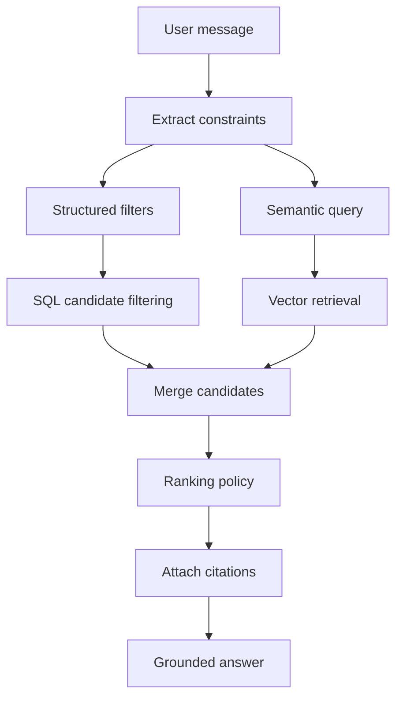
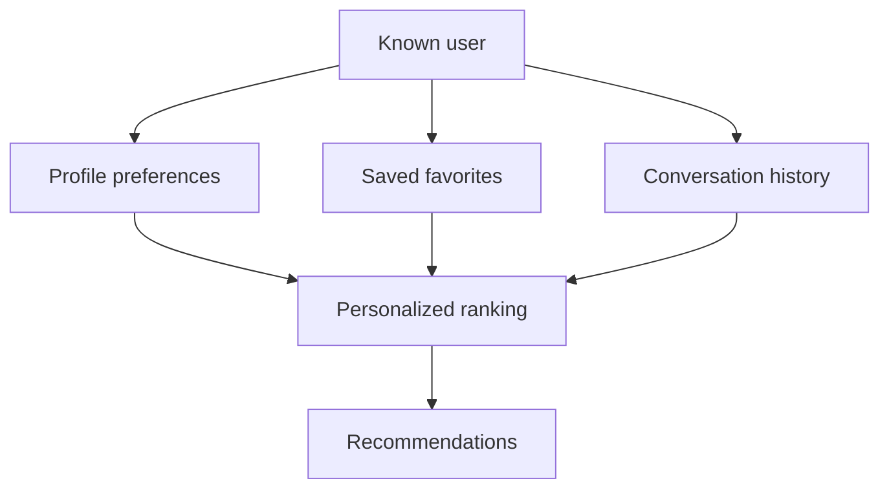

# Data And RAG Design

## Source Content

Initial content comes from WordPress and Directorist:

- Business listings from the Directorist Business Directory.
- Event listings from the Directorist Events Directory.
- Business reviews.
- Weekend Picks newsletter posts.
- Promotions and sponsored content.

Future content sources:

- Blog posts.
- FAQs.
- Mobile-app user profile data.
- Favorites and saved events.
- Push notification preferences.

## Retrieval Model

AI Sunny should combine structured filtering and semantic retrieval. Do not rely on a generic website-context chatbot.

Structured filters:

- Date and time for events.
- Location and distance.
- Category and directory type.
- Child age range.
- Indoor/outdoor suitability.
- Amenities.
- Budget or price level.
- Featured/sponsored state.

Semantic retrieval:

- User intent and natural-language needs.
- Synonyms such as "rainy day", "indoor", "toddler friendly", "stroller friendly".
- Editorial context from Weekend Picks and FAQs.
- Review text where relevant.



## Ranking Policy

Ranking should prioritize relevance first.

Base signals:

- Semantic similarity.
- Exact structured match.
- Event date match.
- Location/distance match.
- Age suitability.
- Amenity match.
- Category match.
- Freshness.
- Review/rating signal when available.

Business signals:

- Featured business member.
- Sponsored event or promotion.
- Active promotion.

Featured and sponsored content can receive a ranking boost only after meeting the user's actual constraints. If a sponsored item appears, response metadata should include `is_sponsored: true`; the UI can display a small label.

## Clarifying Questions

Ask a follow-up question when a high-quality answer needs missing constraints:

- Child ages.
- Preferred location.
- Date or time window.
- Indoor/outdoor preference.
- Budget.
- Willingness to drive.

Do not over-ask. If enough defaults are available, answer and include a follow-up prompt.

## Citation Rules

Every recommendation should include:

- Title.
- Direct URL.
- Source type.
- Reason it matched.
- Sponsored/featured flags.

The assistant should avoid inventing details not present in retrieved content. If event dates or business hours are uncertain, say so and link to the source.

## Content Normalization

Embedding text should include:

```text
Title: Sunny Play Cafe
Source Type: Business Listing
Summary: Indoor play space with coffee and toddler area.
Categories: Indoor Activities, Cafes
Locations: Palm Beach Gardens
Amenities: Playground, Changing table
Age Range: 1-8
Price Level: $$
Description: Cleaned listing content.
Reviews: Short selected review snippets.
Editorial Notes: Weekend Picks mentions when available.
```

Exclude:

- Raw HTML.
- Admin-only notes.
- Private user data.
- Payment information.
- Generic empty custom field labels.

## Personalization

Personalization is future-facing but should be designed now.

Inputs:

- Children ages.
- Home location or preferred areas.
- Interests.
- Budget.
- Travel distance.
- Favorite businesses and events.
- Previous conversation history.



Rules:

- Anonymous users can receive session-level continuity.
- Logged-in users can receive cross-device personalization.
- Users must have a path to delete or reset personalization data.
- Do not personalize sponsored content beyond relevance; relevance remains the first requirement.

## Tool Design

The LangGraph agent should use server-owned tools:

```json
{
  "name": "search_events",
  "arguments": {
    "date": "2026-07-11",
    "location": "Palm Beach",
    "age_min": 3,
    "age_max": 7,
    "indoor": null,
    "limit": 6
  }
}
```

Tool outputs should be compact:

```json
{
  "results": [
    {
      "source_type": "event_listing",
      "source_id": "2001",
      "title": "Saturday Story Time",
      "url": "https://example.com/events/story-time",
      "starts_at": "2026-07-11T10:00:00-04:00",
      "reason": "Matches date and age range.",
      "score": 0.91,
      "is_sponsored": false
    }
  ]
}
```

## Evaluation

Track:

- Top recommendation click-through.
- Citation click-through.
- Zero-result rate.
- Clarifying-question rate.
- User thumbs-up/down when available.
- Sponsored impression and click metrics.
- Event-date correctness.
- Results with missing URLs.
- Backend latency and OpenAI token usage.
