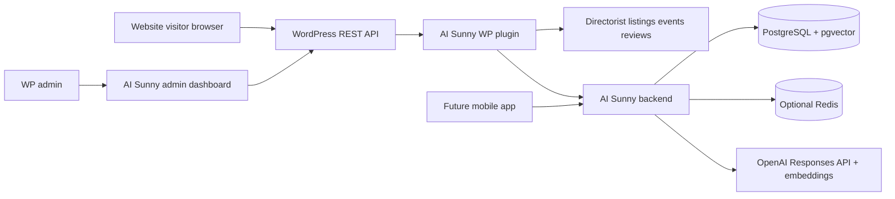

# Ask Sunny Architecture Documentation

Ask Sunny is a single-tenant AI concierge for Palm Beach Mama Club. It uses WordPress and Directorist as the source of truth for local business and event content, and a separate backend service for conversational RAG, retrieval, persistence, and OpenAI integration.

This documentation is based on:

- OpenAI Responses API documentation: https://developers.openai.com/api/docs/guides/migrate-to-responses and https://developers.openai.com/api/reference/responses/overview/
- OpenAI conversation state documentation: https://developers.openai.com/api/docs/guides/conversation-state
- LangGraph JavaScript documentation: https://docs.langchain.com/oss/javascript/langgraph/overview
- LangGraph persistence documentation: https://docs.langchain.com/oss/python/langgraph/persistence

## Document Map

- `SERVER_APP_ARCHITECTURE.md`: backend runtime, LangGraph flow, OpenAI Responses usage, security, failures, and server flow charts.
- `SERVER_DATABASE_SCHEMA.md`: PostgreSQL schema for content, embeddings, conversations, user data, analytics, admin sessions, and migrations.
- `SERVER_REST_API_CONTRACT.md`: backend REST endpoints called by WordPress, future mobile clients, and server admins.
- `WP_PLUGIN_ARCHITECTURE.md`: WordPress plugin services, admin UI, frontend widget, Directorist hooks, and plugin flow charts.
- `WP_PLUGIN_DATA_SCHEMA.md`: WordPress options, post meta, user meta, transients, and payload mapping rules.
- `WP_PLUGIN_REST_API_CONTRACT.md`: WordPress REST endpoints used by the admin dashboard and browser widget.
- `DATA_AND_RAG_DESIGN.md`: source content model, retrieval strategy, ranking, sponsorship handling, citations, and personalization.
- `SETUP_AND_OPERATIONS.md`: environment variables, setup, deployment, migrations, monitoring, backup, and troubleshooting.

## System Summary

WordPress remains responsible for collecting site content, rendering the website widget, protecting browser-facing REST endpoints, and sending server-side requests to the Ask Sunny backend. The launch content sources are the Directorist Business Directory, Directorist Events Directory, business reviews, Weekend Picks, and sponsored/promotional content. The backend owns chat orchestration, retrieval, embeddings, conversation persistence, ranking, citations, analytics, and future mobile-app access.

## Core Decisions

- Ask Sunny is single-tenant.
- Browser JavaScript calls WordPress REST only. Browser code never receives the OpenAI API key or backend API keys.
- The backend uses LangGraph for orchestration and short-term workflow state. Application tables store durable conversation, message, tool-call, profile, and usage records.
- The backend uses OpenAI Responses API for agentic model calls, tool use, streaming, and multi-turn reasoning. Implementation should verify the current recommended model before launch.
- WordPress and Directorist remain the content source of truth for launch. Backend content tables are an indexed search/read model.
- Featured businesses and sponsored events can influence ranking only when relevant to the user's request.
