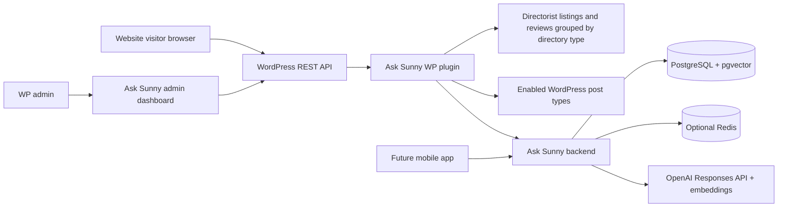

# Ask Sunny Architecture Documentation

Ask Sunny is a single-tenant, content-grounded AI concierge for a WordPress website. It uses WordPress and Directorist as the source of truth for site content and a separate backend service for conversational RAG, retrieval, persistence, and OpenAI integration.

This documentation follows these requirements and architectural patterns:

- WordPress/Directorist plugin integration patterns for extracting Directorist listings and listing reviews by directory type, plus optionally enabled WordPress post types.
- A separate backend-service pattern for conversational retrieval, persistence, embeddings, and OpenAI integration. The backend should live outside the WordPress installation.
- OpenAI Responses API documentation: https://developers.openai.com/api/docs/guides/migrate-to-responses and https://developers.openai.com/api/reference/responses/overview/
- OpenAI conversation state documentation: https://developers.openai.com/api/docs/guides/conversation-state
- LangGraph JavaScript documentation: https://docs.langchain.com/oss/javascript/langgraph/overview
- LangGraph persistence documentation: https://docs.langchain.com/oss/python/langgraph/persistence

## Product Requirements

Ask Sunny should be a content-grounded AI concierge, not a chatbot that answers from unverified general context. It must search the site's configured structured and editorial sources before answering, reason over the results, and return direct links to relevant source pages.

The content types, taxonomies, dynamic fields, and examples in these documents are illustrative and must be configurable for each installation rather than tied to a particular organization, audience, or location.

Primary user scenarios:

- A visitor asks for events in a particular location and date range.
- A user asks for a directory listing that matches specific categories, custom metadata, or amenities.
- A visitor asks a question answered by an editorial article, newsletter post, or FAQ.
- A user continues the conversation with constraints such as budget, distance, location, availability, accessibility, or other site-defined criteria.

Launch requirements:

- Always retrieve Directorist listings, with each Directorist directory type represented as its own data source.
- Index Directorist listing reviews as separate data sources, classified by the parent listing's directory type.
- Let administrators enable or disable eligible non-Directorist post types as additional data sources and constrain them with taxonomy or approved metadata filters.
- Search listings, categories, locations, event dates, amenities, reviews, and custom fields before generating recommendations.
- Attach stable context metadata to every data source so retrieval can filter before semantic ranking.
- Include content from enabled WordPress post-type sources only when it matches that source's indexing filters.
- Show all data sources and per-item indexing status in a WordPress admin submenu, grouped into source tabs.
- Return direct website links for citations and recommendation cards.
- Return each chat turn as one complete JSON response; do not stream partial output.
- Preserve conversation context across follow-up questions.
- Power the website first while keeping the backend reusable for a future mobile app.
- Keep WordPress as the centralized source of truth for launch content.

Future-facing requirements:

- Add further public post types as configurable retrievable sources.
- Support user accounts across website and mobile app.
- Let users save favorite content items.
- Store preferences such as location, interests, budget, accessibility needs, preferred distance, and other site-defined criteria.
- Use preferences, favorites, and conversation history for personalized recommendations.
- Support push notifications for new or time-sensitive matching content.
- Prioritize featured content or configured promotion metadata only when it is relevant to the user's request.

## Document Map

### Planning

- [`planning/SERVER_TASK_PLAN.md`](SERVER_TASK_PLAN.md): standalone backend plan organized by user story, Given–When–Then acceptance criteria, and implementation tasks.
- [`planning/PLUGIN_TASK_PLAN.md`](PLUGIN_TASK_PLAN.md): standalone WordPress plugin plan organized by user story, Given–When–Then acceptance criteria, and implementation tasks.

### Server

- [`server/SERVER_APP_ARCHITECTURE.md`](server/SERVER_APP_ARCHITECTURE.md): backend runtime, LangGraph flow, OpenAI Responses usage, security, failures, and server flow charts.
- [`server/SERVER_DATABASE_SCHEMA.md`](server/SERVER_DATABASE_SCHEMA.md): PostgreSQL schema for content, embeddings, conversations, user data, analytics, admin sessions, and migrations.
- [`server/SERVER_REST_API_CONTRACT.md`](server/SERVER_REST_API_CONTRACT.md): backend REST endpoints called by WordPress, future mobile clients, and server admins.

### Plugin

- [`plugin/WP_PLUGIN_ARCHITECTURE.md`](plugin/WP_PLUGIN_ARCHITECTURE.md): WordPress plugin services, admin UI, frontend widget, Directorist hooks, and plugin flow charts.
- [`plugin/WP_PLUGIN_DATA_SCHEMA.md`](plugin/WP_PLUGIN_DATA_SCHEMA.md): WordPress options, post meta, user meta, transients, and payload mapping rules.
- [`plugin/WP_PLUGIN_REST_API_CONTRACT.md`](plugin/WP_PLUGIN_REST_API_CONTRACT.md): WordPress REST endpoints used by the admin dashboard and browser widget.

### Shared

- [`shared/DATA_AND_RAG_DESIGN.md`](shared/DATA_AND_RAG_DESIGN.md): source content model, retrieval strategy, ranking, dynamic-field handling, citations, and personalization.
- [`shared/SETUP_AND_OPERATIONS.md`](shared/SETUP_AND_OPERATIONS.md): environment variables, setup, deployment, migrations, monitoring, backup, and troubleshooting.

## System Summary

WordPress remains responsible for collecting site content, rendering the website widget, protecting browser-facing REST endpoints, and sending server-side requests to the Ask Sunny backend. Directorist listings are the required primary content source. Directorist's multi-directory feature classifies listings into directory types; an Event Directory is therefore a listing data source with event-specific fields, not a separate event entity. Approved listing reviews are indexed as separate review records and retain the parent listing's directory classification. Administrators may add eligible non-Directorist post types such as posts, pages, or custom post types as optional sources. The backend owns chat orchestration, retrieval, embeddings, conversation persistence, ranking, citations, analytics, and future mobile-app access.

## Core Decisions

- Ask Sunny is single-tenant. Do not use a multi-tenant `sites` and `site_domains` model as the main architecture.
- Browser JavaScript calls WordPress REST only. Browser code never receives the OpenAI API key or backend API keys.
- The backend uses LangGraph for orchestration and short-term workflow state. Application tables store durable conversation, message, tool-call, profile, and usage records.
- The backend uses OpenAI Responses API for agentic model calls, tool use, complete-response generation, and multi-turn reasoning. Chat responses are not streamed. Implementation should verify the current recommended model before launch.
- WordPress and Directorist remain the content source of truth for launch. Backend content tables are an indexed search/read model.
- Backend content storage is separated by source kind: Directorist listings, Directorist reviews, and optional WordPress content use different tables and embedding tables.
- Every Directorist directory type produces mandatory listing and review data sources that cannot be disabled or excluded. Optional WordPress post-type sources are explicitly enabled by an administrator.
- Every directory type has a companion Directorist review data source for approved reviews. Review records link back to their parent listing and are not embedded into the listing record.
- Retrieval filters by `data_source_key` and source context metadata; `source_kind` alone is not a sufficient context boundary.
- WordPress owns the admin enable/disable controls and indexing filters. It synchronizes the resulting `allowed_data_source_keys` to the backend, which stores and enforces that allowlist for every RAG query. Disabling a source updates the allowlist without deleting indexed records.
- Featured content or configured promotion metadata can influence ranking only when relevant to the user's request.
