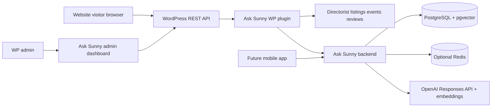

# Ask Sunny Architecture Documentation

Ask Sunny is a single-tenant AI concierge for Palm Beach Mama Club. It uses WordPress and Directorist as the source of truth for local business and event content, and a separate backend service for conversational RAG, retrieval, persistence, and OpenAI integration.

This documentation follows these requirements and architectural patterns:

- WordPress/Directorist plugin integration patterns for extracting listing, event, review, and editorial content.
- A separate backend-service pattern for conversational retrieval, persistence, embeddings, and OpenAI integration. The backend should live outside the WordPress installation.
- OpenAI Responses API documentation: https://developers.openai.com/api/docs/guides/migrate-to-responses and https://developers.openai.com/api/reference/responses/overview/
- OpenAI conversation state documentation: https://developers.openai.com/api/docs/guides/conversation-state
- LangGraph JavaScript documentation: https://docs.langchain.com/oss/javascript/langgraph/overview
- LangGraph persistence documentation: https://docs.langchain.com/oss/python/langgraph/persistence

## Product Requirements

Ask Sunny should be an AI concierge, not a generic website-context chatbot. It must search structured Palm Beach Mama Club data before answering, reason over the results, and return direct links to relevant businesses, events, and editorial pages.

Primary user scenarios:

- A mom asks for things to do near Palm Beach for children of specific ages on a specific date.
- A visitor asks for indoor activities when it rains.
- A parent asks for a restaurant or business with a specific amenity, such as a playground.
- A user continues the conversation with follow-up constraints such as budget, travel distance, location, indoor/outdoor preference, or child ages.

Launch requirements:

- Retrieve from the Directorist Business Directory and Events Directory.
- Search listings, categories, locations, event dates, amenities, reviews, and custom fields before generating recommendations.
- Include Weekend Picks content published on the website, even if the email edition is sent through Beehiiv.
- Return direct website links for citations and recommendation cards.
- Preserve conversation context across follow-up questions.
- Power the website first while keeping the backend reusable for a future mobile app.
- Keep WordPress as the centralized source of truth for launch content.

Future-facing requirements:

- Add blog posts, FAQs, promotions, and sponsored content as retrievable sources.
- Support user accounts across website and mobile app.
- Let users save favorite businesses and events.
- Store preferences such as children ages, location, interests, budget, and preferred travel distance.
- Use preferences, favorites, and conversation history for personalized recommendations.
- Support push-notification use cases for nearby events and matching listings.
- Prioritize featured business members and sponsored events only when they are relevant to the user's request.

## Document Map

### Server

- [`server/SERVER_APP_ARCHITECTURE.md`](server/SERVER_APP_ARCHITECTURE.md): backend runtime, LangGraph flow, OpenAI Responses usage, security, failures, and server flow charts.
- [`server/SERVER_DATABASE_SCHEMA.md`](server/SERVER_DATABASE_SCHEMA.md): PostgreSQL schema for content, embeddings, conversations, user data, analytics, admin sessions, and migrations.
- [`server/SERVER_REST_API_CONTRACT.md`](server/SERVER_REST_API_CONTRACT.md): backend REST endpoints called by WordPress, future mobile clients, and server admins.

### Plugin

- [`plugin/WP_PLUGIN_ARCHITECTURE.md`](plugin/WP_PLUGIN_ARCHITECTURE.md): WordPress plugin services, admin UI, frontend widget, Directorist hooks, and plugin flow charts.
- [`plugin/WP_PLUGIN_DATA_SCHEMA.md`](plugin/WP_PLUGIN_DATA_SCHEMA.md): WordPress options, post meta, user meta, transients, and payload mapping rules.
- [`plugin/WP_PLUGIN_REST_API_CONTRACT.md`](plugin/WP_PLUGIN_REST_API_CONTRACT.md): WordPress REST endpoints used by the admin dashboard and browser widget.

### Shared

- [`shared/DATA_AND_RAG_DESIGN.md`](shared/DATA_AND_RAG_DESIGN.md): source content model, retrieval strategy, ranking, sponsorship handling, citations, and personalization.
- [`shared/SETUP_AND_OPERATIONS.md`](shared/SETUP_AND_OPERATIONS.md): environment variables, setup, deployment, migrations, monitoring, backup, and troubleshooting.

## System Summary

WordPress remains responsible for collecting site content, rendering the website widget, protecting browser-facing REST endpoints, and sending server-side requests to the Ask Sunny backend. The launch content sources are the Directorist Business Directory, Directorist Events Directory, business reviews, Weekend Picks, and sponsored/promotional content. The backend owns chat orchestration, retrieval, embeddings, conversation persistence, ranking, citations, analytics, and future mobile-app access.

## Core Decisions

- Ask Sunny is single-tenant. Do not use a multi-tenant `sites` and `site_domains` model as the main architecture.
- Browser JavaScript calls WordPress REST only. Browser code never receives the OpenAI API key or backend API keys.
- The backend uses LangGraph for orchestration and short-term workflow state. Application tables store durable conversation, message, tool-call, profile, and usage records.
- The backend uses OpenAI Responses API for agentic model calls, tool use, streaming, and multi-turn reasoning. Implementation should verify the current recommended model before launch.
- WordPress and Directorist remain the content source of truth for launch. Backend content tables are an indexed search/read model.
- Featured businesses and sponsored events can influence ranking only when relevant to the user's request.
