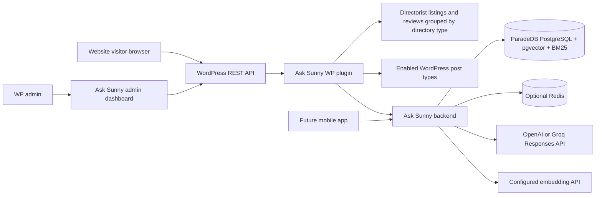

# Ask Sunny Architecture Documentation

Ask Sunny is a single-tenant, content-grounded AI concierge for a WordPress website. It uses WordPress and Directorist as the source of truth for site content and a separate backend service for conversational RAG, hybrid retrieval, persistence, and provider-selectable AI generation.

This documentation follows these requirements and architectural patterns:

- WordPress/Directorist plugin integration patterns for extracting mandatory Directorist listings, optional listing reviews by directory type, and optionally enabled WordPress post types.
- A backend-service pattern that runs natively or through optional Docker Compose for conversational retrieval, persistence, embeddings, and provider-selectable OpenAI or Groq generation. The backend lives outside the WordPress installation.
- ParadeDB on PostgreSQL for hybrid search using BM25 keyword matching and pgvector similarity, merged through configurable ranking.
- OpenAI Responses API documentation: https://developers.openai.com/api/docs/guides/migrate-to-responses and https://developers.openai.com/api/reference/responses/overview/
- OpenAI conversation state documentation: https://developers.openai.com/api/docs/guides/conversation-state
- Groq Responses API and OpenAI compatibility documentation: https://console.groq.com/docs/responses-api and https://console.groq.com/docs/openai
- ParadeDB self-hosted extension documentation: https://docs.paradedb.com/deploy/self-hosted/extension
- LangGraph JavaScript documentation: https://docs.langchain.com/oss/javascript/langgraph/overview
- LangGraph persistence documentation: https://docs.langchain.com/oss/python/langgraph/persistence

## Product Requirements

Ask Sunny should be a content-grounded AI concierge, not a chatbot that answers from unverified general context. It must search the site's configured structured and editorial sources before answering, reason over the results, and return direct links to relevant source pages.

The content types, taxonomies, dynamic fields, and examples in these documents are illustrative and must be configurable for each installation rather than tied to a particular organization, audience, or location.

Primary user scenarios:

- A visitor asks for events in a particular location and date range.
- A user asks for a directory listing that matches specific categories, custom metadata, or amenities.
- A visitor asks a question answered by an editorial article, newsletter post, or FAQ.
- A user continues the conversation with constraints such as budget, distance, location, availability, accessibility, or other site-defined criteria.

Launch requirements:

- Always retrieve Directorist listings, with each Directorist directory type represented as its own data source.
- Discover Directorist listing reviews as an optional source family classified by parent directory type and controlled by one global reviews setting rather than per-directory toggles.
- Let administrators enable or disable eligible non-Directorist post types as additional data sources and constrain them with taxonomy or approved metadata filters.
- Search listings, categories, locations, event dates, amenities, custom fields, and reviews when the global Listing Reviews source is enabled before generating recommendations.
- Attach stable context metadata to every data source so retrieval can filter before semantic ranking.
- Include content from enabled WordPress post-type sources only when it matches that source's indexing filters.
- Show **Listings** and **Listing Reviews** as the two initial Data Sources tabs, with the required filters, then add an individual tab for each optional post type enabled in settings.
- Let administrators filter every Data Sources item table by index status, including indexed, not indexed, pending, failed, deleted, skipped, and ineligible records.
- Return direct website links for citations and recommendation cards.
- Return each chat turn as one complete JSON response; do not stream partial output.
- Preserve conversation context across follow-up questions.
- Let administrators choose the pages where the chat widget appears and configure its color scheme, screen position, and welcome message.
- Select OpenAI or Groq for chat generation through one server environment variable while keeping all provider credentials and model settings in environment variables.
- Support both native and optional Docker server deployment, with ParadeDB BM25 + pgvector as the normal production retrieval mode only after its package and readiness gates pass.
- Provide an admin Test Chat submenu for exercising the widget UI and backend API integration.
- Power the website first while keeping the backend reusable for a future mobile app.
- Keep WordPress as the centralized source of truth for launch content.

Future-facing requirements:

- Add further public post types as configurable retrievable sources.
- Support user accounts across website and mobile app.
- Let users save favorite content items.
- Store preferences such as location, interests, budget, accessibility needs, preferred distance, and other site-defined criteria.
- Use preferences, favorites, and conversation history for personalized recommendations.
- Support push notifications for new or time-sensitive matching content.
- Prioritize featured content or configured promotion metadata only when it is relevant to the user's request.

## Document Map

### Planning

- [`task-planning/SERVER_TASK_PLAN.md`](task-planning/SERVER_TASK_PLAN.md): standalone backend plan organized by user story, Given–When–Then acceptance criteria, and implementation tasks.
- [`task-planning/PLUGIN_TASK_PLAN.md`](task-planning/PLUGIN_TASK_PLAN.md): standalone WordPress plugin plan organized by user story, Given–When–Then acceptance criteria, and implementation tasks.

### Server

- [`server/SERVER_APP_ARCHITECTURE.md`](server/SERVER_APP_ARCHITECTURE.md): native/optional-Docker runtime, ParadeDB hybrid retrieval, provider-selectable Responses usage, security, failures, and server flow charts.
- [`server/HYBRID_SEARCH_PLAN.md`](server/HYBRID_SEARCH_PLAN.md): BM25 + pgvector rollout, package compatibility gate, RRF policy, failure behavior, tests, and evaluation.
- [`server/RANKING_AND_CITATION_CONTRACT.md`](server/RANKING_AND_CITATION_CONTRACT.md): versioned relevance-first ranking, review aggregation, promotion disclosures, citations, uncertainty, deduplication, and evaluation gates.
- [`server/SEMANTIC_SEARCH_ARCHITECTURE_AND_FLOW_GUIDE.md`](server/SEMANTIC_SEARCH_ARCHITECTURE_AND_FLOW_GUIDE.md): Ask Sunny indexing, retrieval, chat, caching, security, and semantic-search flows.
- [`server/SERVER_DATABASE_SCHEMA.md`](server/SERVER_DATABASE_SCHEMA.md): PostgreSQL schema for content, embeddings, conversations, user data, analytics, admin sessions, and migrations.
- [`server/SERVER_REST_API_CONTRACT.md`](server/SERVER_REST_API_CONTRACT.md): backend REST endpoints called by WordPress, future mobile clients, and server admins.

### Plugin

- [`plugin/WP_PLUGIN_ARCHITECTURE.md`](plugin/WP_PLUGIN_ARCHITECTURE.md): WordPress plugin services, admin UI, frontend widget, Directorist hooks, and plugin flow charts.
- [`plugin/WP_PLUGIN_DATA_SCHEMA.md`](plugin/WP_PLUGIN_DATA_SCHEMA.md): WordPress options, post meta, user meta, transients, and payload mapping rules.
- [`plugin/WP_PLUGIN_REST_API_CONTRACT.md`](plugin/WP_PLUGIN_REST_API_CONTRACT.md): WordPress REST endpoints used by the admin dashboard and browser widget.

### Shared

- [`shared/DATA_AND_RAG_DESIGN.md`](shared/DATA_AND_RAG_DESIGN.md): source content model, retrieval strategy, ranking, dynamic-field handling, citations, and personalization.
- [`shared/SETUP_AND_OPERATIONS.md`](shared/SETUP_AND_OPERATIONS.md): environment variables, setup, deployment, migrations, monitoring, backup, and troubleshooting.

## System Summary

WordPress remains responsible for collecting site content, configuring and rendering the website widget, protecting browser-facing REST endpoints, and sending server-side requests to the Ask Sunny backend. Directorist listings are the required primary content source. Directorist's multi-directory feature classifies listings into directory types; an Event Directory is therefore a listing data source with event-specific fields, not a separate event entity. Approved listing reviews may be enabled as separate optional sources and retain the parent listing's directory classification. Administrators may also enable eligible non-Directorist post types such as posts, pages, or custom post types. The backend owns chat orchestration, ParadeDB hybrid retrieval, embeddings, conversation persistence, ranking, citations, analytics, and future mobile-app access.

## Core Decisions

- Ask Sunny is single-tenant. Do not use a multi-tenant `sites` and `site_domains` model as the main architecture.
- Browser JavaScript calls WordPress REST only. Browser code never receives AI-provider, embedding-provider, or backend API keys.
- The backend uses LangGraph for orchestration and short-term workflow state. Application tables store durable conversation, message, tool-call, profile, and usage records.
- The backend uses a provider-neutral abstraction for Responses API calls. `AI_PROVIDER=openai|groq` selects a registered adapter at runtime; provider keys, base URLs, models, and embedding settings remain environment configuration, while database tables store no provider discriminator or provider-specific conversation state. Chat responses are not streamed.
- Native or Dockerized ParadeDB uses `pg_search` for BM25 and pgvector for dense similarity. Hybrid retrieval is the verified production default and fuses both candidate sets only after applying the stored data-source allowlist and structured filters. Installation and upgrades begin with hybrid disabled; it must not be enabled until the installed package/image matches the running PostgreSQL major version, execution OS, and architecture and all extension, index, and smoke checks pass.
- WordPress and Directorist remain the content source of truth for launch. Backend content tables are an indexed search/read model.
- Backend content storage is separated by source kind. Directorist listings use a dedicated `listings` table with inline normalized state and vector data; reviews and optional WordPress content use their own content and embedding tables.
- Every Directorist directory type produces a mandatory listing source that cannot be disabled. Listing reviews are optional as one global source family; the administrator does not enable or disable reviews per directory type. Optional WordPress post-type sources are explicitly enabled by an administrator.
- When the global reviews setting is enabled, approved reviews from every directory type are indexed as separate records linked to their parent listing; review text is not embedded into the listing record.
- Retrieval filters by `data_source_key` and source context metadata; `source_kind` alone is not a sufficient context boundary.
- WordPress owns the admin enable/disable controls and indexing filters. It synchronizes the resulting `allowed_data_source_keys` to the backend, which stores and enforces that allowlist for every RAG query. Disabling a source updates the allowlist without deleting indexed records.
- Featured content or configured promotion metadata can influence ranking only when relevant to the user's request.
