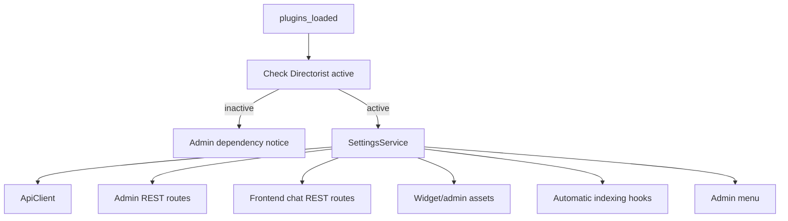
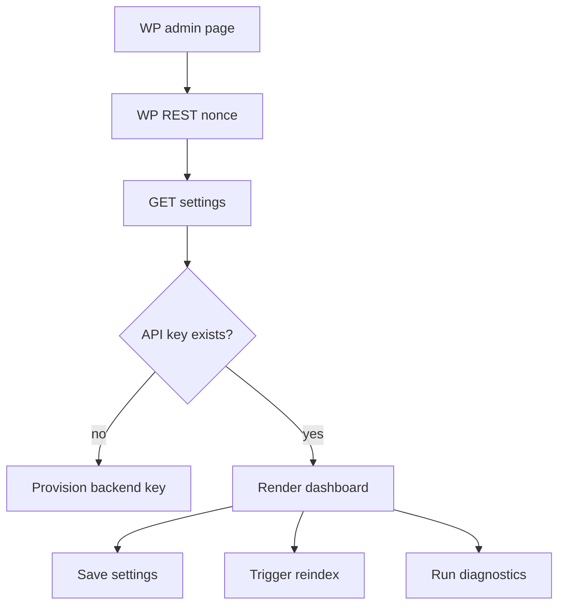
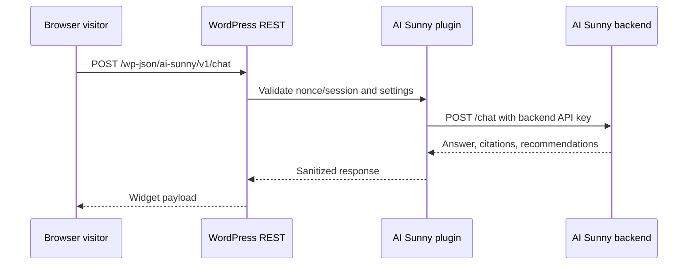
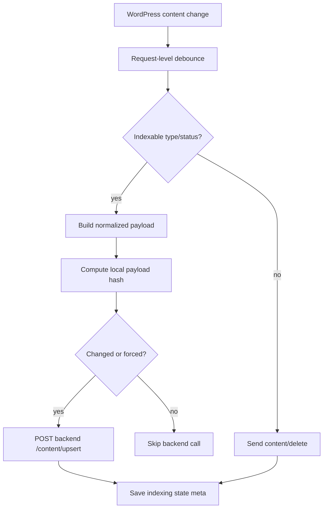

# WordPress Plugin Architecture

## Purpose

The AI Sunny WordPress plugin is the integration layer between WordPress/Directorist, the public browser widget, the admin dashboard, and the AI Sunny backend.

The plugin is responsible for:

- Detecting Directorist and registering plugin services.
- Managing settings and backend provisioning.
- Extracting business, event, review, newsletter, and promotion content.
- Sending indexing payloads to the backend.
- Exposing WordPress REST endpoints for the admin SPA and frontend widget.
- Rendering/enqueuing the chatbot widget on public pages.
- Proxying browser chat requests to the backend.
- Keeping backend secrets out of browser JavaScript.

## Plugin Structure

Follow the existing `directorist-ai-search` style:

```text
ai-sunny/
  ai-sunny.php
  inc/
    Core/
      Plugin.php
      Activator.php
      Deactivator.php
    Admin/
      AdminMenu.php
      AdminRestController.php
    Services/
      ApiClient.php
      SettingsService.php
      DirectoristDependencyService.php
      ContentPayloadService.php
      AutomaticIndexingService.php
      ChatProxyService.php
      FrontendAssetsService.php
      WidgetSettingsService.php
      DiagnosticsService.php
    Traits/
      Singleton.php
  assets/
    js/
      admin.js
      widget.js
    css/
      admin.css
      widget.css
```

## Boot Flow



Services that only show dependency notices may run without Directorist. Directorist-dependent services should wait until Directorist is active.

## Admin Dashboard

The admin dashboard lives under a Directorist or WordPress admin menu item. It should include:

- Connection status.
- Provisioning status.
- Widget enable/disable and display rules.
- Manual reindex controls.
- Indexing status table.
- Diagnostics.
- Recent usage summary fetched from backend.



## Frontend Widget

The frontend widget is rendered by WordPress and talks only to WordPress REST.



For streaming, WordPress should proxy SSE from the backend when the host supports it. If streaming is unavailable, fall back to `POST /chat`.

## Indexing Hooks

Register hooks for:

- Directorist business listing create/update.
- Directorist event listing create/update.
- Post status transitions.
- Post meta changes relevant to Directorist fields.
- Taxonomy changes for categories, locations, and tags.
- Review create/update/delete if reviews are part of launch scope.
- Weekend Picks/newsletter post publish/update.
- Trash/delete/unpublish.



Like AI Search, background queue processing can be deferred for v1. Request-level debouncing and shutdown-time indexing are acceptable for launch, but the docs should leave a path for Action Scheduler or a custom queue.

## Content Payload Responsibilities

`ContentPayloadService` must:

- Resolve the post type into `source_type`.
- Extract title, excerpt, content, permalink, status, modified time.
- Extract Directorist directory type, categories, locations, tags, amenities, custom fields, featured flag, price, contact fields, geolocation, and images where useful.
- Extract event dates from the Events Directory source.
- Extract reviews and ratings if available.
- Include `raw_payload` for debugging and `normalized_payload` for backend retrieval.
- Strip HTML and unsafe markup.

## Chat Proxy Responsibilities

`ChatProxyService` must:

- Accept sanitized browser/admin input from WordPress REST.
- Attach `anonymous_session_id` or WordPress user ID.
- Attach page URL and timezone context.
- Call backend `/chat` or `/chat/stream` server-side.
- Sanitize backend responses before returning to the browser.
- Preserve citation URLs and recommendation card data.
- Fail gracefully with a user-friendly message.

## Security

- Backend API URL can be configured by constant/env first, then admin setting if allowed.
- Generated backend API key is stored in WordPress options, never localized to JavaScript.
- Browser widget uses REST nonce for logged-in users and an anonymous session token for visitors.
- Admin endpoints require `manage_options`.
- Frontend chat endpoint should rate limit by IP/session with transients.
- All rendered answer text must be escaped or sanitized; citations must pass URL validation.

