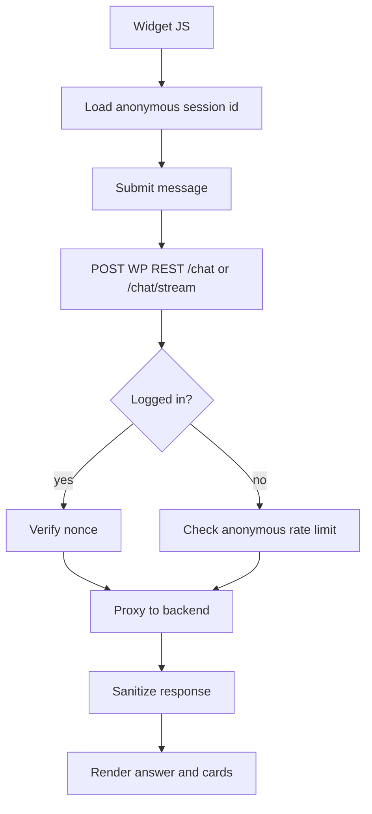

# WordPress Plugin REST API Contract

Namespace:

```text
/wp-json/ai-sunny/v1
```

Admin routes require `manage_options` and a valid REST nonce. Frontend routes accept a REST nonce for logged-in users or an anonymous session token for visitors.

## Error Shape

Use `WP_Error` responses with stable codes:

```json
{
  "code": "ai_sunny_backend_unavailable",
  "message": "Ask Sunny is unavailable right now.",
  "data": {
    "status": 503
  }
}
```

## Admin Routes

### `GET /settings`

Returns sanitized settings. Does not return the full backend API key.

Response:

```json
{
  "enabled": true,
  "api_base_url": "https://api.example.com",
  "api_key_configured": true,
  "api_key_prefix": "ais_live",
  "widget_enabled": true,
  "widget_position": "bottom_right",
  "indexing_enabled": true,
  "debug_logging": false
}
```

### `POST /settings`

Updates admin settings.

Request:

```json
{
  "enabled": true,
  "widget_enabled": true,
  "widget_position": "bottom_right",
  "indexing_enabled": true,
  "request_timeout": 20,
  "debug_logging": false
}
```

Response:

```json
{
  "ok": true,
  "message": "Settings saved."
}
```

### `POST /provision`

Calls backend `/auth/provision-installation` using a server-side provisioning key.

Response:

```json
{
  "ok": true,
  "api_key_configured": true,
  "api_key_prefix": "ais_live"
}
```

### `POST /index/:id`

Indexes one content item by WordPress post ID.

Request:

```json
{
  "force": false
}
```

Response:

```json
{
  "ok": true,
  "post_id": 1514,
  "status": "indexed",
  "backend_content_id": "uuid"
}
```

### `POST /reindex`

Starts or continues a reindex operation.

Request:

```json
{
  "source_types": ["business_listing", "event_listing", "weekend_pick"],
  "force": false,
  "batch_size": 25
}
```

Response:

```json
{
  "ok": true,
  "running": true,
  "processed": 25,
  "total": 400,
  "failed": 0,
  "cursor": 25
}
```

### `GET /index/status`

Returns local indexing status.

```json
{
  "running": false,
  "processed": 400,
  "total": 400,
  "failed": 0,
  "last_successful_sync_at": "2026-07-06T12:00:00Z"
}
```

### `GET /diagnostics`

Checks WordPress-side and backend health.

```json
{
  "directorist_active": true,
  "api_key_configured": true,
  "backend": {
    "ok": true,
    "database": "ok",
    "openai": "configured"
  },
  "indexable_counts": {
    "business_listing": 250,
    "event_listing": 80
  }
}
```

## Frontend Routes

### `POST /chat`

Proxies a non-streaming chat turn to the backend.

Request:

```json
{
  "conversation_id": "optional-uuid",
  "anonymous_session_id": "browser-session-id",
  "message": "Where can I find indoor activities if it rains today?",
  "page_url": "https://palmbeachmamaclub.com"
}
```

Response:

```json
{
  "conversation_id": "uuid",
  "message_id": "uuid",
  "answer": "Here are indoor options...",
  "recommendations": [],
  "citations": [],
  "follow_up_questions": []
}
```

### `POST /chat/stream`

Proxies backend SSE to the browser.

Request matches `/chat`.

SSE events should pass through:

- `conversation`
- `delta`
- `recommendation`
- `done`
- `error`

If the server or host cannot support streaming, return:

```json
{
  "error": {
    "code": "streaming_unavailable",
    "message": "Streaming is unavailable. Use /chat."
  }
}
```

## Permission Model

- `GET /settings`, `POST /settings`, `POST /provision`, `POST /index/:id`, `POST /reindex`, `GET /index/status`, and `GET /diagnostics`: `current_user_can('manage_options')`.
- `POST /chat` and `POST /chat/stream`: public when widget is enabled, rate limited by IP/session, and sanitized.

## Frontend Flow



