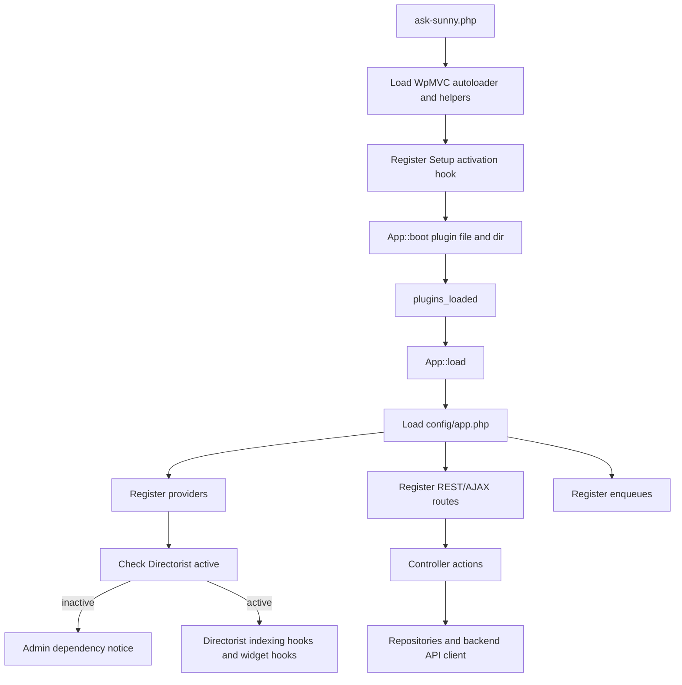
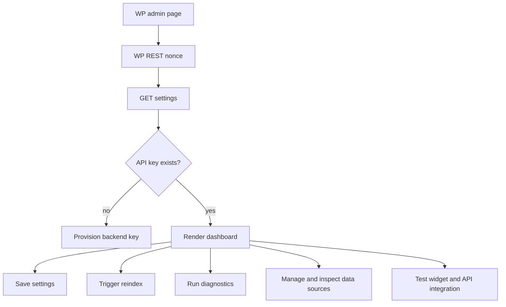
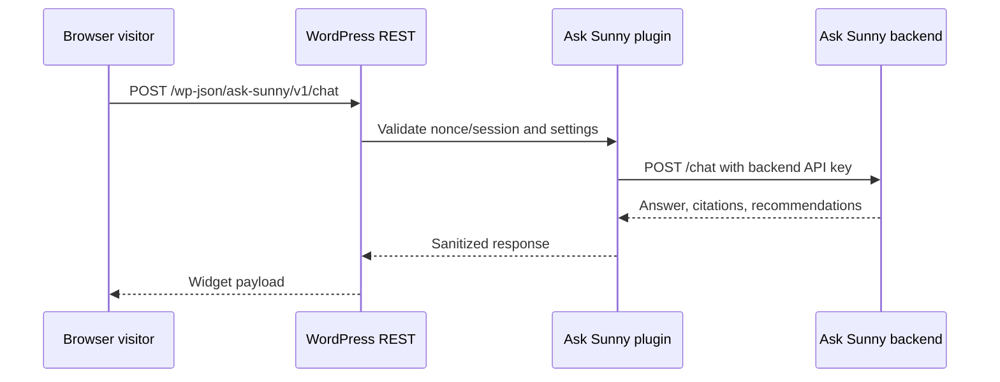
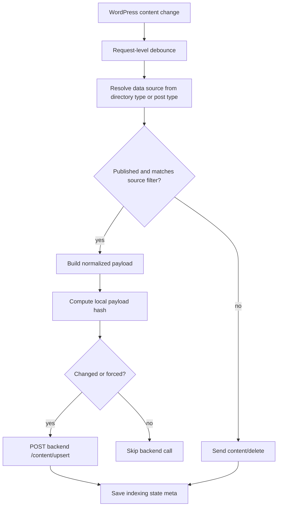

# WordPress Plugin Architecture

## Purpose

The Ask Sunny WordPress plugin is the integration layer between WordPress/Directorist, the public browser widget, the admin dashboard, and the Ask Sunny backend.

The plugin is responsible for:

- Detecting Directorist and registering WpMVC providers, controllers, routes, and enqueues.
- Managing settings and backend provisioning.
- Extracting mandatory Directorist listings, approved reviews when the global optional Listing Reviews setting is enabled, and content from enabled non-Directorist WordPress post types.
- Sending indexing payloads to the backend.
- Exposing WordPress REST endpoints for the admin SPA and frontend widget.
- Rendering/enqueuing the chatbot widget on public pages.
- Proxying browser chat requests to the backend.
- Keeping backend secrets out of browser JavaScript.

## Plugin Structure

Follow the WpMVC pattern used by `directorist-pricing-plans-new`, not the older flat service layout. The plugin bootstrap should be thin, and feature code should live under `app/`, `routes/`, `resources/`, `config/`, `database/`, and `enqueues/`.

```text
ask-sunny/
  ask-sunny.php
  composer.json
  config/
    app.php
  database/
    Setup.php
    Migrations/
  routes/
    rest/
      api.php
      admin.php
    ajax/
      api.php
  enqueues/
    admin-enqueue.php
    frontend-enqueue.php
  app/
    DTO/
      Chat/
      Content/
      Settings/
    Helpers/
      helper.php
    Http/
      Controllers/
        Admin/
          ChatTestController.php
          DataSourcesController.php
          DiagnosticsController.php
          IndexingController.php
          ProvisioningController.php
          SettingsController.php
        ChatController.php
        ContentController.php
        Controller.php
      Middleware/
        EnsureCanManageSettings.php
        EnsureWidgetEnabled.php
    Models/
      IndexedContent.php
      Setting.php
      UserPreference.php
    Providers/
      Admin/
        MenuServiceProvider.php
        NoticeServiceProvider.php
      DirectoristHooksServiceProvider.php
      FrontendWidgetServiceProvider.php
      ShortcodeServiceProvider.php
    Repositories/
      BackendApiRepository.php
      ContentPayloadRepository.php
      IndexingRepository.php
      SettingsRepository.php
      UserPreferenceRepository.php
    Services/
      ApiClient.php
      ContentNormalizer.php
      ChatProxy.php
  resources/
    js/
      admin/
      frontend/
    sass/
    views/
      admin/
      frontend/
      templates/
  assets/
    build/
      js/
      css/
```

## WpMVC Responsibilities

- `ask-sunny.php`: load the WpMVC autoloader, helper files, register activation setup, boot the WpMVC `App`, and call `$application->load()` on `plugins_loaded`.
- `config/app.php`: define the REST/AJAX namespace, route middleware, service providers, admin providers, migration option key, migrations, and response hooks.
- `routes/rest/api.php`: register public/frontend routes and route groups.
- `routes/rest/admin.php`: register admin-only routes behind admin middleware.
- `app/Http/Controllers`: receive WpMVC route requests, validate input, call repositories/services, and return WpMVC responses.
- `app/Models`: wrap local WordPress tables/options/meta where a model is useful. Do not put remote backend records here unless WordPress owns them.
- `app/Repositories`: own persistence and integration boundaries such as options, post meta, Directorist extraction, and backend API calls.
- `app/Providers`: register WordPress hooks, menus, shortcodes, Directorist integrations, notices, widget rendering, and frontend/admin boot behavior.
- `resources/views`: hold PHP templates rendered through WpMVC view helpers.
- `enqueues`: register and enqueue admin/frontend builds through the WpMVC enqueue helper.
- `database/Setup.php` and `database/Migrations`: create or migrate local plugin tables only if options/meta are not enough.

## WpMVC Configuration

Use `config/app.php` for plugin wiring:

```php
return [
    'version' => Helpers::get_plugin_version( 'ask-sunny' ),
    'rest_api' => [
        'namespace' => 'ask-sunny',
        'versions' => [],
    ],
    'ajax_api' => [
        'namespace' => 'ask-sunny',
        'versions' => [],
    ],
    'providers' => [
        DirectoristHooksServiceProvider::class,
        FrontendWidgetServiceProvider::class,
        ShortcodeServiceProvider::class,
    ],
    'admin_providers' => [
        MenuServiceProvider::class,
        NoticeServiceProvider::class,
    ],
    'middleware' => [
        'admin' => EnsureCanManageSettings::class,
        'widget' => EnsureWidgetEnabled::class,
    ],
    'migration_db_option_key' => 'ask_sunny_migrations',
    'migrations' => [],
];
```

## Route Layout

`routes/rest/api.php` should group frontend routes and include admin routes behind middleware:

```php
Route::group(
    'admin',
    function() {
        require_once __DIR__ . '/admin.php';
    },
    ['admin']
);

Route::group(
    'chat',
    function() {
        Route::post( '/', [ChatController::class, 'create'] );
    },
    ['widget']
);
```

`routes/rest/admin.php` should keep dashboard actions controller-driven:

```php
Route::get( 'settings', [SettingsController::class, 'show'] );
Route::post( 'settings', [SettingsController::class, 'update'] );
Route::get( 'data-sources', [DataSourcesController::class, 'index'] );
Route::post( 'data-sources/{key}', [DataSourcesController::class, 'update'] );
Route::get( 'data-sources/{key}/items', [DataSourcesController::class, 'items'] );
Route::post( 'data-sources/{key}/delete-indexed-data', [DataSourcesController::class, 'deleteIndexedData'] );
Route::post( 'provision', [ProvisioningController::class, 'store'] );
Route::post( 'index/{id}', [IndexingController::class, 'index'] );
Route::post( 'index/{id}/delete', [IndexingController::class, 'delete'] );
Route::post( 'reindex', [IndexingController::class, 'reindex'] );
Route::get( 'index/status', [IndexingController::class, 'status'] );
Route::get( 'diagnostics', [DiagnosticsController::class, 'show'] );
Route::post( 'test-chat', [ChatTestController::class, 'create'] );
```

## Asset Layout

Source assets should live under `resources/`, while compiled output should live under `assets/build/`.

```text
resources/
  js/
    admin.js
    widget.js
  sass/
    admin.scss
    widget.scss
assets/
  build/
    js/
    css/
```

## Boot Flow



Providers that only show dependency notices may run without Directorist. Directorist-dependent providers should wait until Directorist is active before registering indexing hooks, listing integrations, or Directorist-specific UI.

## Admin Dashboard

The admin dashboard lives under a Directorist or WordPress admin menu item. Dedicated **Data Sources** and **Test Chat** submenus are required.

The Data Sources submenu should include:

- Connection status.
- Provisioning status.
- Widget enable/disable, page targeting, color scheme, position, and welcome-message settings.
- Manual reindex controls.
- A WordPress-owned source registry that controls which records are sent to the backend.
- Backend allowlist synchronization status and version, with a retry action when WordPress and backend differ.
- Exactly two initial tabs: **Listings** and **Listing Reviews**.
- A **Listings** tab aggregating all Directorist directory types, with filter controls for directory type, WordPress/listing status, category, and location. Listing sources are always enabled and cannot be excluded.
- A **Listing Reviews** tab aggregating reviews from all directory types, with a directory-type filter. Reviews are controlled by one global optional setting; there are no per-directory enable/disable controls.
- Enable/disable controls for eligible non-Directorist post types such as posts, pages, and public custom post types.
- One additional tab for each enabled non-Directorist post type. Each tab provides status, category, and tag filters when those taxonomies are registered for that post type.
- Source label, description, and context metadata fields for each optional post-type source.
- Status, category, tag, and allowlisted post-meta indexing filters for optional post-type sources, limited to statuses and taxonomies supported by that post type.
- A paginated item table within each tab showing matching listings, reviews, or posts, including filtered-out items, with title, record type, WordPress status, eligibility, backend index status, RAG retrieval status, last indexed time, and last error. Provide a per-item retry/reindex action when the item is eligible.
- An explicit **Delete indexed data** action on each item and a destructive **Delete all indexed data** action for each source tab, both protected by confirmation and `manage_options`.
- Diagnostics.
- Recent usage summary fetched from backend.

The Test Chat submenu should render the production widget component in an isolated admin preview and send messages through an admin-only WordPress REST route. It displays connection/provider/hybrid-search diagnostics, request correlation ID, latency, answer, citations, recommendations, and sanitized errors. Test conversations use the backend `admin_test` channel and must not bypass the same response validation or source allowlist used by public chat.



## Frontend Widget

The frontend widget is rendered by WordPress and talks only to WordPress REST.

Before enqueueing or rendering the global widget, the provider evaluates the saved display rule against the current queried page. Supported launch modes are:

- `all_pages`: render on all public frontend pages.
- `selected_pages`: render only on selected published WordPress page IDs.
- `excluded_pages`: render on all public frontend pages except selected page IDs.
- `shortcode_only`: do not render globally; render only where the shortcode is present.

The admin-configurable appearance includes a color scheme (`light`, `dark`, `auto`, or `custom`), sanitized custom color tokens when `custom` is selected, a screen position (`bottom_right` or `bottom_left`), and a plain-text welcome message. WordPress localizes only sanitized public widget configuration to pages where the widget renders. Secrets and raw admin settings are never localized.



The widget renders the configured welcome message before the first user turn, waits for `POST /chat` to complete, and renders the returned answer, citations, recommendations, and follow-up questions together. Do not expose an SSE or incremental-response route.

## Indexing Hooks

Register hooks for:

- Directorist listing create/update for every directory type.
- Post status transitions.
- Post meta changes relevant to Directorist fields.
- Taxonomy changes for categories, locations, and tags.
- Directorist review create/update/approve/unapprove/spam/trash/delete, processed only when the global Listing Reviews setting is enabled and indexed independently from the parent listing.
- Publish/update for every enabled optional WordPress post-type source.
- Taxonomy and allowlisted post-meta changes that can cause an optional item to enter or leave its configured source filter.
- Trash/delete/unpublish.



Background queue processing can be deferred for v1. Request-level debouncing and shutdown-time indexing are acceptable for launch, but the docs should leave a path for Action Scheduler or a custom queue.

## Content Payload Responsibilities

`ContentPayloadRepository` and `ContentNormalizer` must:

- Resolve each Directorist listing's directory type into a mandatory `data_source_key`; do not create a separate source kind for events.
- When the global Listing Reviews setting is enabled, resolve each approved Directorist review into the classified companion key for its parent listing's directory type, with `source_kind = directorist_review`, a unique comment ID, and an explicit parent listing relationship.
- Resolve enabled non-Directorist post types into optional `data_source_key` values and evaluate their configured filters before indexing.
- Emit `source_kind`, `data_source_key`, `data_source_label`, `source_context`, and `wordpress_post_type` with every item.
- Extract title, excerpt, content, permalink, status, modified time.
- Discover the active Directory Builder field definitions for the listing's directory type and classify each as a Directorist core preset or generic non-core listing metadata.
- Map core preset values to canonical top-level fields backed by backend database columns, including categories, locations, tags, amenities, featured flag, price, contact fields, geolocation, images, and view count.
- Store every non-core field in the same flat `listing_metadata` map, preserving stable keys, labels, optional provider, field type, and sanitized typed values. Do not separate custom fields from extension/third-party presets.
- Store extension-provided event dates in generic listing metadata rather than dedicated event columns.
- Extract review text and rating into an independent review payload; do not add review text to the parent listing embedding.
- Include `raw_payload` for debugging and `normalized_payload` for backend retrieval.
- Strip HTML and unsafe markup.

`DataSourcesController` and the source registry must:

- Discover all Directorist directory types and expose required enabled listing keys plus classified review keys governed by one global optional Listing Reviews setting.
- Discover eligible public WordPress post types while excluding the Directorist listing post type and internal WordPress/plugin types.
- Validate editable context metadata as bounded scalar key/value pairs.
- Validate taxonomy filters against taxonomies registered to the selected post type and validate selected term IDs.
- Restrict post-meta filtering to an explicit key/operator allowlist.
- Include source identity and RAG context metadata with every content upsert; do not send enable/disable settings or filter configuration to the backend.
- Reconcile filter changes by deleting backend items that became ineligible and indexing items that became eligible.
- Disabling an optional source must not delete its backend records. Stop automatic indexing for that source and atomically synchronize the revised `allowed_data_source_keys` to backend retrieval configuration. Re-enabling it restores the key and queues eligible items for reconciliation.
- Delete backend data only when an administrator explicitly chooses per-item deletion or **Delete all indexed data**. Deleting all does not disable the source; warn that an enabled source can be indexed again by later updates or reindexing.
- Synchronize the complete allowlist after provisioning, after Directorist directory-type discovery changes, and after every source enable/disable change. The settings operation succeeds only when the backend persists the new list; on failure, preserve or restore the previous WordPress setting and surface a retryable admin error.
- When global Listing Reviews is enabled, include every discovered directory review key in the allowlist; when disabled, remove every review key atomically. Do not offer per-directory review enablement.
- Read listing/post index state from post meta and review index state from comment meta for the per-source item tables.

## Chat Proxy Responsibilities

`ChatController` and `ChatProxy` must:

- Accept sanitized browser/admin input from WordPress REST.
- Attach `anonymous_session_id` or WordPress user ID.
- Attach page URL and timezone context.
- Do not attach source settings or an allowlist to individual chat requests; backend retrieval uses its persisted configuration.
- Call backend `/chat` server-side and wait for the complete response.
- Use a WordPress/backend HTTP timeout long enough for complete generation; the recommended default is 60 seconds and must exceed the backend's selected AI-provider request timeout.
- Sanitize backend responses before returning to the browser.
- Preserve citation URLs and recommendation card data.
- Fail gracefully with a user-friendly message.

## Security

- Backend API URL can be configured by constant/env first, then admin setting if allowed.
- Generated backend API key is stored in WordPress options, never localized to JavaScript.
- Browser widget uses REST nonce for logged-in users and an anonymous session token for visitors.
- Admin endpoints require `manage_options`.
- Frontend chat endpoint should rate limit by IP/session with transients.
- All rendered answer text must be escaped or sanitized; citations must pass URL validation.
