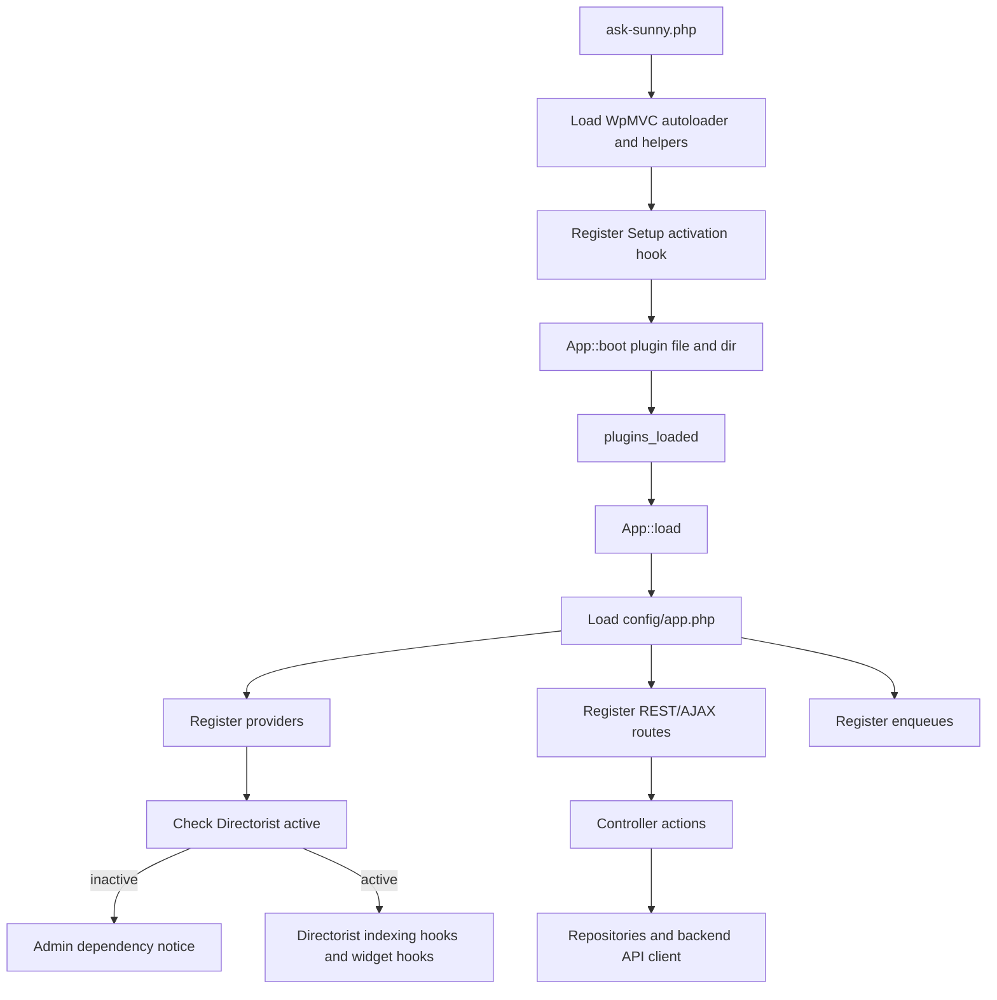
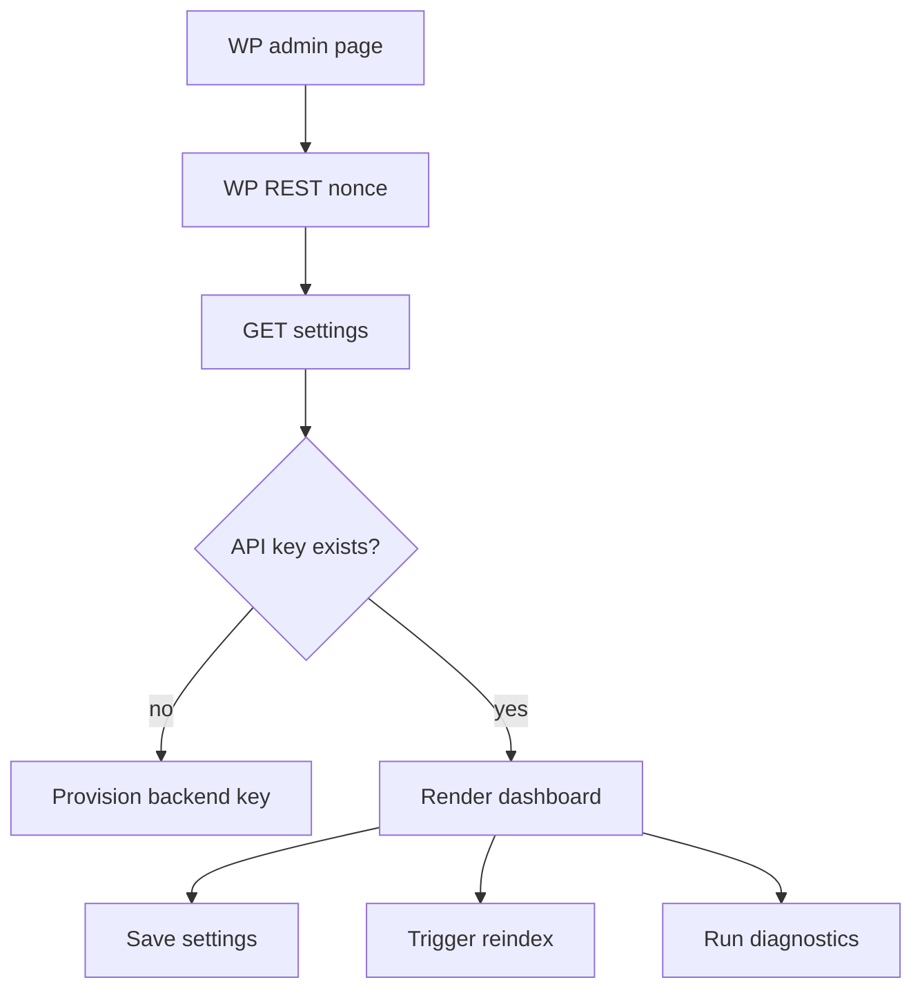
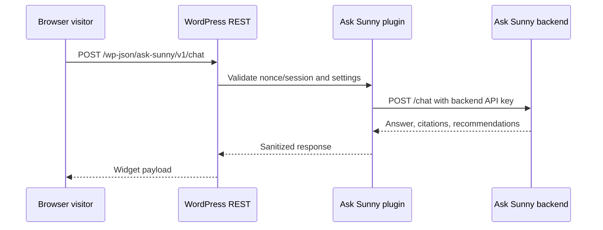
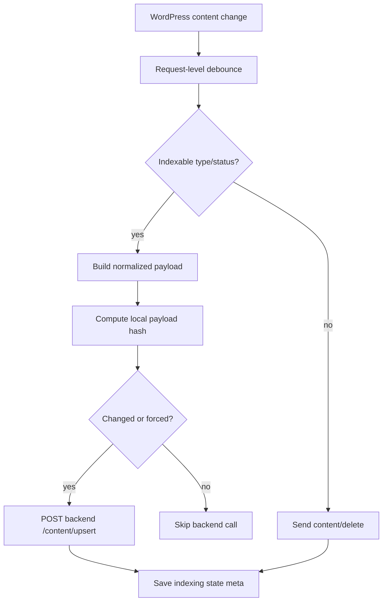

# WordPress Plugin Architecture

## Purpose

The Ask Sunny WordPress plugin is the integration layer between WordPress/Directorist, the public browser widget, the admin dashboard, and the Ask Sunny backend.

The plugin is responsible for:

- Detecting Directorist and registering WpMVC providers, controllers, routes, and enqueues.
- Managing settings and backend provisioning.
- Extracting configured directory, event, review, editorial, and promotion content.
- Sending indexing payloads to the backend.
- Exposing WordPress REST endpoints for the admin SPA and frontend widget.
- Rendering/enqueuing the chatbot widget on public pages.
- Proxying browser chat requests to the backend.
- Keeping backend secrets out of browser JavaScript.

## Plugin Structure

Follow the WpMVC pattern used by `directorist-pricing-plans-new`, not the older flat service layout. The plugin bootstrap should be thin, and feature code should live under `app/`, `routes/`, `resources/`, `config/`, `database/`, and `enqueues/`.

```text
ask-sunny/
  ask-sunny.php
  composer.json
  config/
    app.php
  database/
    Setup.php
    Migrations/
  routes/
    rest/
      api.php
      admin.php
    ajax/
      api.php
  enqueues/
    admin-enqueue.php
    frontend-enqueue.php
  app/
    DTO/
      Chat/
      Content/
      Settings/
    Helpers/
      helper.php
    Http/
      Controllers/
        Admin/
          DiagnosticsController.php
          IndexingController.php
          ProvisioningController.php
          SettingsController.php
        ChatController.php
        ContentController.php
        Controller.php
      Middleware/
        EnsureCanManageSettings.php
        EnsureWidgetEnabled.php
    Models/
      IndexedContent.php
      Setting.php
      UserPreference.php
    Providers/
      Admin/
        MenuServiceProvider.php
        NoticeServiceProvider.php
      DirectoristHooksServiceProvider.php
      FrontendWidgetServiceProvider.php
      ShortcodeServiceProvider.php
    Repositories/
      BackendApiRepository.php
      ContentPayloadRepository.php
      IndexingRepository.php
      SettingsRepository.php
      UserPreferenceRepository.php
    Services/
      ApiClient.php
      ContentNormalizer.php
      ChatProxy.php
  resources/
    js/
      admin/
      frontend/
    sass/
    views/
      admin/
      frontend/
      templates/
  assets/
    build/
      js/
      css/
```

## WpMVC Responsibilities

- `ask-sunny.php`: load the WpMVC autoloader, helper files, register activation setup, boot the WpMVC `App`, and call `$application->load()` on `plugins_loaded`.
- `config/app.php`: define the REST/AJAX namespace, route middleware, service providers, admin providers, migration option key, migrations, and response hooks.
- `routes/rest/api.php`: register public/frontend routes and route groups.
- `routes/rest/admin.php`: register admin-only routes behind admin middleware.
- `app/Http/Controllers`: receive WpMVC route requests, validate input, call repositories/services, and return WpMVC responses.
- `app/Models`: wrap local WordPress tables/options/meta where a model is useful. Do not put remote backend records here unless WordPress owns them.
- `app/Repositories`: own persistence and integration boundaries such as options, post meta, Directorist extraction, and backend API calls.
- `app/Providers`: register WordPress hooks, menus, shortcodes, Directorist integrations, notices, widget rendering, and frontend/admin boot behavior.
- `resources/views`: hold PHP templates rendered through WpMVC view helpers.
- `enqueues`: register and enqueue admin/frontend builds through the WpMVC enqueue helper.
- `database/Setup.php` and `database/Migrations`: create or migrate local plugin tables only if options/meta are not enough.

## WpMVC Configuration

Use `config/app.php` for plugin wiring:

```php
return [
    'version' => Helpers::get_plugin_version( 'ask-sunny' ),
    'rest_api' => [
        'namespace' => 'ask-sunny',
        'versions' => [],
    ],
    'ajax_api' => [
        'namespace' => 'ask-sunny',
        'versions' => [],
    ],
    'providers' => [
        DirectoristHooksServiceProvider::class,
        FrontendWidgetServiceProvider::class,
        ShortcodeServiceProvider::class,
    ],
    'admin_providers' => [
        MenuServiceProvider::class,
        NoticeServiceProvider::class,
    ],
    'middleware' => [
        'admin' => EnsureCanManageSettings::class,
        'widget' => EnsureWidgetEnabled::class,
    ],
    'migration_db_option_key' => 'ask_sunny_migrations',
    'migrations' => [],
];
```

## Route Layout

`routes/rest/api.php` should group frontend routes and include admin routes behind middleware:

```php
Route::group(
    'admin',
    function() {
        require_once __DIR__ . '/admin.php';
    },
    ['admin']
);

Route::group(
    'chat',
    function() {
        Route::post( '/', [ChatController::class, 'create'] );
        Route::post( 'stream', [ChatController::class, 'stream'] );
    },
    ['widget']
);
```

`routes/rest/admin.php` should keep dashboard actions controller-driven:

```php
Route::get( 'settings', [SettingsController::class, 'show'] );
Route::post( 'settings', [SettingsController::class, 'update'] );
Route::post( 'provision', [ProvisioningController::class, 'store'] );
Route::post( 'index/{id}', [IndexingController::class, 'index'] );
Route::post( 'reindex', [IndexingController::class, 'reindex'] );
Route::get( 'index/status', [IndexingController::class, 'status'] );
Route::get( 'diagnostics', [DiagnosticsController::class, 'show'] );
```

## Asset Layout

Source assets should live under `resources/`, while compiled output should live under `assets/build/`.

```text
resources/
  js/
    admin.js
    widget.js
  sass/
    admin.scss
    widget.scss
assets/
  build/
    js/
    css/
```

## Boot Flow



Providers that only show dependency notices may run without Directorist. Directorist-dependent providers should wait until Directorist is active before registering indexing hooks, listing integrations, or Directorist-specific UI.

## Admin Dashboard

The admin dashboard lives under a Directorist or WordPress admin menu item. It should include:

- Connection status.
- Provisioning status.
- Widget enable/disable and display rules.
- Manual reindex controls.
- Indexing status table.
- Diagnostics.
- Recent usage summary fetched from backend.



## Frontend Widget

The frontend widget is rendered by WordPress and talks only to WordPress REST.



For streaming, WordPress should proxy SSE from the backend when the host supports it. If streaming is unavailable, fall back to `POST /chat`.

## Indexing Hooks

Register hooks for:

- Configured Directorist listing create/update.
- Directorist event listing create/update.
- Post status transitions.
- Post meta changes relevant to Directorist fields.
- Taxonomy changes for categories, locations, and tags.
- Review create/update/delete if reviews are part of launch scope.
- Configured editorial/newsletter post publish/update.
- Trash/delete/unpublish.



Background queue processing can be deferred for v1. Request-level debouncing and shutdown-time indexing are acceptable for launch, but the docs should leave a path for Action Scheduler or a custom queue.

## Content Payload Responsibilities

`ContentPayloadRepository` and `ContentNormalizer` must:

- Resolve the post type into `source_type`.
- Extract title, excerpt, content, permalink, status, modified time.
- Extract Directorist directory type, categories, locations, tags, amenities, custom fields, featured flag, price, contact fields, geolocation, and images where useful.
- Extract event dates when the source supports them.
- Extract reviews and ratings if available.
- Include `raw_payload` for debugging and `normalized_payload` for backend retrieval.
- Strip HTML and unsafe markup.

## Chat Proxy Responsibilities

`ChatController` and `ChatProxy` must:

- Accept sanitized browser/admin input from WordPress REST.
- Attach `anonymous_session_id` or WordPress user ID.
- Attach page URL and timezone context.
- Call backend `/chat` or `/chat/stream` server-side.
- Sanitize backend responses before returning to the browser.
- Preserve citation URLs and recommendation card data.
- Fail gracefully with a user-friendly message.

## Security

- Backend API URL can be configured by constant/env first, then admin setting if allowed.
- Generated backend API key is stored in WordPress options, never localized to JavaScript.
- Browser widget uses REST nonce for logged-in users and an anonymous session token for visitors.
- Admin endpoints require `manage_options`.
- Frontend chat endpoint should rate limit by IP/session with transients.
- All rendered answer text must be escaped or sanitized; citations must pass URL validation.
