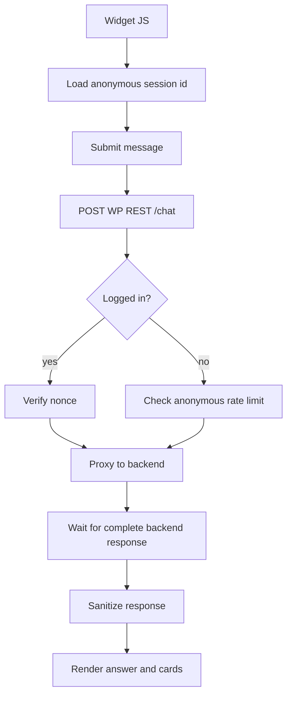

# WordPress Plugin REST API Contract

Namespace:

```text
/wp-json/ask-sunny/v1
```

Admin routes require `manage_options` and a valid REST nonce. Frontend routes accept a REST nonce for logged-in users or an anonymous session token for visitors.

## Error Shape

Use `WP_Error` responses with stable codes:

```json
{
  "code": "ask_sunny_backend_unavailable",
  "message": "Ask Sunny is unavailable right now.",
  "data": {
    "status": 503
  }
}
```

## Admin Routes

### `GET /settings`

Returns sanitized settings. Does not return the full backend API key.

Response:

```json
{
  "enabled": true,
  "api_base_url": "https://api.example.com",
  "api_key_configured": true,
  "api_key_prefix": "ask_live",
  "widget_enabled": true,
  "widget_position": "bottom_right",
  "indexing_enabled": true,
  "debug_logging": false
}
```

### `POST /settings`

Updates admin settings.

Request:

```json
{
  "enabled": true,
  "widget_enabled": true,
  "widget_position": "bottom_right",
  "indexing_enabled": true,
  "request_timeout": 60,
  "debug_logging": false
}
```

Response:

```json
{
  "ok": true,
  "message": "Settings saved."
}
```

Data-source configuration is managed through the dedicated routes below, not through generic settings fields. This prevents a client from disabling required Directorist sources.

### `GET /data-sources`

Returns all discovered sources for the Data Sources submenu. Every Directorist directory type produces a required listing source and a required companion review source. Eligible non-Directorist WordPress post types are returned even when disabled so an administrator can opt in.

```json
{
  "groups": [
    {
      "key": "directorist",
      "label": "Directorist Listings",
      "sources": [
        {
          "data_source_key": "directorist:events",
          "source_kind": "directorist_listing",
          "label": "Event Directory",
          "wp_post_type": "at_biz_dir",
          "directory_type_id": "42",
          "required": true,
          "enabled": true,
          "context_metadata": {"content_kind": "event"},
          "counts": {"eligible": 80, "indexed": 77, "pending": 2, "failed": 1}
        }
      ]
    },
    {
      "key": "directorist_reviews",
      "label": "Listing Reviews",
      "sources": [
        {
          "data_source_key": "directorist:events:reviews",
          "source_kind": "directorist_review",
          "label": "Event Directory Reviews",
          "wp_post_type": "at_biz_dir",
          "directory_type_id": "42",
          "parent_data_source_key": "directorist:events",
          "required": true,
          "enabled": true,
          "context_metadata": {"content_kind": "review", "reviewed_content_kind": "event"},
          "counts": {"eligible": 125, "indexed": 124, "pending": 0, "failed": 1}
        }
      ]
    },
    {
      "key": "wordpress",
      "label": "Other Post Types",
      "sources": [
        {
          "data_source_key": "wordpress:post",
          "source_kind": "wordpress_post",
          "label": "Blog",
          "wp_post_type": "post",
          "required": false,
          "enabled": true,
          "context_metadata": {"content_kind": "article", "audience": "public"},
          "filters": {
            "taxonomies": {
              "category": {"operator": "IN", "term_ids": [12, 18]}
            },
            "meta": []
          },
          "counts": {"eligible": 35, "indexed": 35, "pending": 0, "failed": 0}
        }
      ]
    }
  ]
}
```

### `POST /data-sources/:post_type`

Enables, disables, or updates an optional non-Directorist post-type source. Reject Directorist post types, internal post types, invalid taxonomy terms, and non-allowlisted meta filters.

```json
{
  "enabled": true,
  "label": "Blog",
  "description": "Published guides for visitors.",
  "context_metadata": {
    "content_kind": "article",
    "audience": "public"
  },
  "filters": {
    "taxonomies": {
      "category": {"operator": "IN", "term_ids": [12, 18]}
    },
    "meta": []
  }
}
```

Response includes reconciliation counts:

```json
{
  "ok": true,
  "data_source_key": "wordpress:post",
  "enabled": true,
  "queued_for_index": 5,
  "excluded_from_rag": false,
  "backend_items_deleted": 0,
  "allowed_data_sources_version": 5,
  "allowed_data_sources_synced": true
}
```

The editable settings exist in WordPress. The plugin derives the complete allowed-key list and updates backend `PUT /retrieval/allowed-data-sources` using the last known version. Disabling a source preserves its indexed backend records, stops automatic indexing, and removes its key from the persisted backend allowlist. Enabling it adds the key back and queues locally eligible records for reconciliation. A filter change may still reconcile individual items so the indexed set matches the configured filter.

A disable response makes the non-destructive behavior explicit:

```json
{
  "ok": true,
  "data_source_key": "wordpress:post",
  "enabled": false,
  "excluded_from_rag": true,
  "backend_items_preserved": 35,
  "backend_items_deleted": 0,
  "allowed_data_sources_version": 6,
  "allowed_data_sources_synced": true
}
```

If the backend allowlist update fails or returns a version conflict, return an error, keep the previous WordPress source setting, and expose a retry action. Do not show a successful enabled/disabled state that differs from backend retrieval configuration.

### `GET /data-sources/:key/items`

Returns the paginated item table for one source tab. The response includes eligible, ineligible, and not-yet-indexed listings, reviews, or posts so every data item has a visible state. Query parameters include `page`, `per_page`, `search`, and optional `index_status`.

```json
{
  "data_source_key": "directorist:events:reviews",
  "items": [
    {
      "record_id": 845,
      "record_type": "comment",
      "title": "Review for Community Workshop",
      "wp_post_type": "at_biz_dir",
      "wp_status": "approved",
      "parent_data_source_key": "directorist:events",
      "parent_source_id": "2001",
      "eligible": true,
      "index_status": "indexed",
      "retrieval_status": "included",
      "indexed_at": "2026-07-13T08:15:00Z",
      "index_error": null,
      "backend_content_id": "uuid"
    }
  ],
  "pagination": {"page": 1, "per_page": 25, "total": 125, "pages": 5}
}
```

### `POST /index/:id/delete`

Explicitly deletes one indexed item. `data_source_key` determines whether `:id` is a post or review comment ID.

```json
{
  "data_source_key": "directorist:events:reviews"
}
```

```json
{
  "ok": true,
  "record_id": 845,
  "index_status": "deleted"
}
```

### `POST /data-sources/:key/delete-indexed-data`

Explicitly deletes all indexed records for a source after admin confirmation. This action does not disable the source.

```json
{
  "confirm": true
}
```

```json
{
  "ok": true,
  "data_source_key": "wordpress:post",
  "deleted_items": 35,
  "enabled": true
}
```

### `POST /provision`

Calls backend `/auth/provision-installation` using a server-side provisioning key.

Response:

```json
{
  "ok": true,
  "api_key_configured": true,
  "api_key_prefix": "ask_live",
  "allowed_data_sources_synced": true,
  "allowed_data_sources_version": 1
}
```

### `POST /index/:id`

Indexes one content item by its WordPress record ID. The `data_source_key` identifies whether `:id` is a post ID or Directorist review comment ID.

Request:

```json
{
  "data_source_key": "directorist:events",
  "force": false
}
```

Response:

```json
{
  "ok": true,
  "record_id": 1514,
  "status": "indexed",
  "backend_content_id": "uuid"
}
```

### `POST /reindex`

Starts or continues a reindex operation.

Request:

```json
{
  "data_source_keys": ["directorist:events", "directorist:events:reviews", "directorist:businesses", "directorist:businesses:reviews", "wordpress:post"],
  "force": false,
  "batch_size": 25
}
```

Response:

```json
{
  "ok": true,
  "running": true,
  "processed": 25,
  "total": 400,
  "failed": 0,
  "cursor": 25
}
```

### `GET /index/status`

Returns local indexing status.

```json
{
  "running": false,
  "processed": 400,
  "total": 400,
  "failed": 0,
  "last_successful_sync_at": "2026-07-06T12:00:00Z"
}
```

### `GET /diagnostics`

Checks WordPress-side and backend health.

```json
{
  "directorist_active": true,
  "api_key_configured": true,
  "backend": {
    "ok": true,
    "database": "ok",
    "openai": "configured",
    "allowed_data_sources_version": 6,
    "allowed_data_sources_in_sync": true
  },
  "indexable_counts": {
    "directorist:businesses": 250,
    "directorist:businesses:reviews": 410,
    "directorist:events": 80,
    "directorist:events:reviews": 125,
    "wordpress:post": 35
  }
}
```

## Frontend Routes

### `POST /chat`

Proxies one complete chat turn to the backend. The widget receives the response only after answer generation finishes.

Request:

```json
{
  "conversation_id": "optional-uuid",
  "anonymous_session_id": "browser-session-id",
  "message": "Which listings are available this week?",
  "page_url": "https://example.com"
}
```

Response:

```json
{
  "conversation_id": "uuid",
  "message_id": "uuid",
  "answer": "Here are indoor options...",
  "recommendations": [],
  "citations": [],
  "follow_up_questions": []
}
```

WordPress does not attach source settings to the chat request. The backend loads and enforces its persisted allowlist.

## Permission Model

- `GET /settings`, `POST /settings`, `POST /provision`, `POST /index/:id`, `POST /index/:id/delete`, `POST /data-sources/:key/delete-indexed-data`, `POST /reindex`, `GET /index/status`, and `GET /diagnostics`: `current_user_can('manage_options')`.
- `POST /chat`: public when the widget is enabled, rate limited by IP/session, and sanitized.

## Frontend Flow


