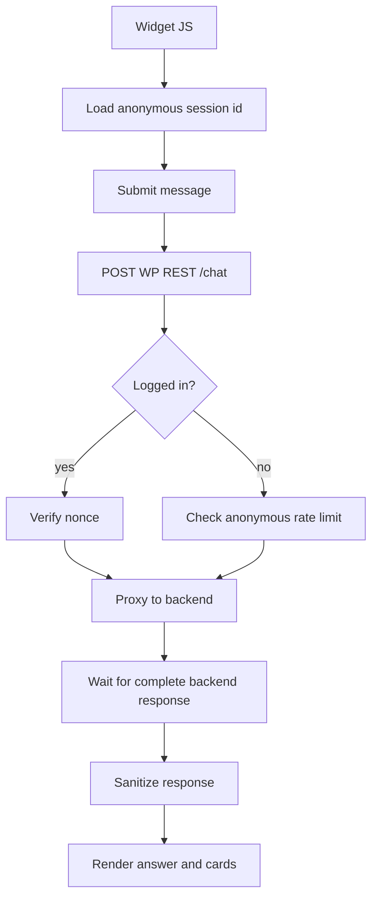

# WordPress Plugin REST API Contract

Namespace:

```text
/wp-json/ask-sunny/v1
```

Admin routes require `manage_options` and a valid REST nonce. Frontend routes accept a REST nonce for logged-in users or an anonymous session token for visitors.

## Error Shape

Use `WP_Error` responses with stable codes:

```json
{
  "code": "ask_sunny_backend_unavailable",
  "message": "Ask Sunny is unavailable right now.",
  "data": {
    "status": 503
  }
}
```

## Admin Routes

### `GET /settings`

Returns sanitized settings. Does not return the full backend API key.

Response:

```json
{
  "enabled": true,
  "api_base_url": "https://api.example.com",
  "api_key_configured": true,
  "api_key_prefix": "ask_live",
  "widget_enabled": true,
  "widget_display_mode": "selected_pages",
  "widget_page_ids": [12, 34],
  "widget_position": "bottom_right",
  "widget_color_scheme": "custom",
  "widget_custom_colors": {
    "primary": "#2563eb",
    "surface": "#ffffff",
    "text": "#111827"
  },
  "widget_welcome_message": "Hi! What would you like to find?",
  "listing_reviews_enabled": false,
  "indexing_enabled": true,
  "debug_logging": false
}
```

### `POST /settings`

Updates admin settings.

Request:

```json
{
  "enabled": true,
  "widget_enabled": true,
  "widget_display_mode": "selected_pages",
  "widget_page_ids": [12, 34],
  "widget_position": "bottom_right",
  "widget_color_scheme": "custom",
  "widget_custom_colors": {
    "primary": "#2563eb",
    "surface": "#ffffff",
    "text": "#111827"
  },
  "widget_welcome_message": "Hi! What would you like to find?",
  "listing_reviews_enabled": true,
  "indexing_enabled": true,
  "request_timeout": 60,
  "debug_logging": false
}
```

Response:

```json
{
  "ok": true,
  "message": "Settings saved."
}
```

Optional WordPress post-type configuration is managed through the dedicated routes below. Global Listing Reviews enablement is the single `listing_reviews_enabled` setting; there are no per-directory review toggles. Required Directorist listing sources cannot be disabled. Widget page IDs must identify published pages; modes, positions, schemes, colors, and welcome messages use strict allowlists, CSS-color sanitization, plain-text sanitization, and documented length limits.

Changing `listing_reviews_enabled` atomically synchronizes all discovered `directorist:*:reviews` keys. Enabling it queues approved reviews across every directory type; disabling it stops review hooks and removes all review keys from retrieval without deleting retained backend rows. If allowlist synchronization fails, preserve the previous setting and return an actionable error.

### `GET /data-sources`

Returns the Data Sources submenu model. The first two tabs are always **Listings** and **Listing Reviews**. Each enabled non-Directorist post type adds its own tab. Directory-specific keys remain internal registry classifications and do not produce per-directory tabs or review toggles.

```json
{
  "tabs": [
    {
      "key": "listings",
      "label": "Listings",
      "source_kind": "directorist_listing",
      "enabled": true,
      "filters": {
        "directory_types": [{"id": "42", "label": "Event Directory"}],
        "statuses": ["publish", "pending", "draft", "trash"],
        "categories": [{"id": 12, "label": "Workshops"}],
        "locations": [{"id": 8, "label": "Downtown"}]
      },
      "counts": {"eligible": 250, "indexed": 247, "pending": 2, "failed": 1}
    },
    {
      "key": "listing-reviews",
      "label": "Listing Reviews",
      "source_kind": "directorist_review",
      "enabled": false,
      "filters": {
        "directory_types": [{"id": "42", "label": "Event Directory"}]
      },
      "counts": {"eligible": 125, "indexed": 0, "pending": 0, "failed": 0}
    },
    {
      "key": "wordpress:post",
      "label": "Posts",
      "source_kind": "wordpress_post",
      "enabled": true,
      "filters": {
        "statuses": ["publish", "draft", "pending", "private", "trash"],
        "categories": [{"id": 12, "label": "Guides"}],
        "tags": [{"id": 7, "label": "Planning"}]
      },
      "saved_indexing_filters": {
        "statuses": ["publish"],
        "taxonomies": {
          "category": {"operator": "IN", "term_ids": [12]},
          "post_tag": {"operator": "IN", "term_ids": [7]}
        }
      },
      "counts": {"eligible": 35, "indexed": 35, "pending": 0, "failed": 0}
    }
  ],
  "available_post_types": [
    {"post_type": "post", "label": "Posts", "enabled": true},
    {"post_type": "page", "label": "Pages", "enabled": false},
    {"post_type": "faq", "label": "FAQs", "enabled": false}
  ]
}
```

### `POST /data-sources/:key`

Enables, disables, or updates an optional non-Directorist post-type source. Reject Directorist listing and review keys, internal post types, invalid statuses/taxonomy terms, and non-allowlisted meta filters. Global Listing Reviews enablement is updated through `POST /settings`; no endpoint enables or disables reviews per directory type.

```json
{
  "enabled": true,
  "label": "Blog",
  "description": "Published guides for visitors.",
  "context_metadata": {
    "content_kind": "article",
    "audience": "public"
  },
  "filters": {
    "statuses": ["publish"],
    "taxonomies": {
      "category": {"operator": "IN", "term_ids": [12, 18]},
      "post_tag": {"operator": "IN", "term_ids": [7, 9]}
    },
    "meta": []
  }
}
```

Response includes reconciliation counts:

```json
{
  "ok": true,
  "data_source_key": "wordpress:post",
  "enabled": true,
  "queued_for_index": 5,
  "excluded_from_rag": false,
  "backend_items_deleted": 0,
  "allowed_data_sources_version": 5,
  "allowed_data_sources_synced": true
}
```

The editable settings exist in WordPress. The plugin derives the complete allowed-key list and updates backend `PUT /retrieval/allowed-data-sources` using the last known version. Disabling a source preserves its indexed backend records, stops automatic indexing, and removes its key from the persisted backend allowlist. Enabling it adds the key back and queues locally eligible records for reconciliation. A filter change may still reconcile individual items so the indexed set matches the configured filter.

A disable response makes the non-destructive behavior explicit:

```json
{
  "ok": true,
  "data_source_key": "wordpress:post",
  "enabled": false,
  "excluded_from_rag": true,
  "backend_items_preserved": 35,
  "backend_items_deleted": 0,
  "allowed_data_sources_version": 6,
  "allowed_data_sources_synced": true
}
```

If the backend allowlist update fails or returns a version conflict, return an error, keep the previous WordPress source setting, and expose a retry action. Do not show a successful enabled/disabled state that differs from backend retrieval configuration.

### `GET /data-sources/:key/items`

Returns the paginated item table for one tab. All tabs support `page`, `per_page`, `search`, and optional `index_status`.

- `listings` supports `directory_type_ids[]`, `statuses[]`, `category_ids[]`, and `location_ids[]`.
- `listing-reviews` supports `directory_type_ids[]`.
- Each enabled `wordpress:{post_type}` tab supports `statuses[]`, `category_ids[]`, and `tag_ids[]` when those taxonomies exist.

The response includes eligible, ineligible, and not-yet-indexed records. Aggregated Directorist tabs return each item's concrete `data_source_key` for indexing actions.

```json
{
  "tab_key": "listing-reviews",
  "items": [
    {
      "data_source_key": "directorist:events:reviews",
      "record_id": 845,
      "record_type": "comment",
      "title": "Review for Community Workshop",
      "wp_post_type": "at_biz_dir",
      "wp_status": "approved",
      "parent_data_source_key": "directorist:events",
      "parent_source_id": "2001",
      "eligible": true,
      "index_status": "indexed",
      "retrieval_status": "included",
      "indexed_at": "2026-07-13T08:15:00Z",
      "index_error": null,
      "backend_content_id": "uuid"
    }
  ],
  "pagination": {"page": 1, "per_page": 25, "total": 125, "pages": 5}
}
```

### `POST /index/:id/delete`

Explicitly deletes one indexed item. `data_source_key` determines whether `:id` is a post or review comment ID.

```json
{
  "data_source_key": "directorist:events:reviews"
}
```

```json
{
  "ok": true,
  "record_id": 845,
  "index_status": "deleted"
}
```

### `POST /data-sources/:key/delete-indexed-data`

Explicitly deletes all indexed records for a source after admin confirmation. This action does not disable the source.

```json
{
  "confirm": true
}
```

```json
{
  "ok": true,
  "data_source_key": "wordpress:post",
  "deleted_items": 35,
  "enabled": true
}
```

### `POST /provision`

Calls backend `/auth/provision-installation` using a server-side provisioning key.

Response:

```json
{
  "ok": true,
  "api_key_configured": true,
  "api_key_prefix": "ask_live",
  "allowed_data_sources_synced": true,
  "allowed_data_sources_version": 1
}
```

### `POST /index/:id`

Indexes one content item by its WordPress record ID. The `data_source_key` identifies whether `:id` is a post ID or Directorist review comment ID.

Request:

```json
{
  "data_source_key": "directorist:events",
  "force": false
}
```

Response:

```json
{
  "ok": true,
  "record_id": 1514,
  "status": "indexed",
  "backend_content_id": "uuid"
}
```

### `POST /reindex`

Starts or continues a reindex operation.

Request:

```json
{
  "data_source_keys": ["directorist:events", "directorist:events:reviews", "directorist:businesses", "wordpress:post"],
  "force": false,
  "batch_size": 25
}
```

Response:

```json
{
  "ok": true,
  "running": true,
  "processed": 25,
  "total": 400,
  "failed": 0,
  "cursor": 25
}
```

### `GET /index/status`

Returns local indexing status.

```json
{
  "running": false,
  "processed": 400,
  "total": 400,
  "failed": 0,
  "last_successful_sync_at": "2026-07-06T12:00:00Z"
}
```

### `GET /diagnostics`

Checks WordPress-side and backend health.

```json
{
  "directorist_active": true,
  "api_key_configured": true,
  "backend": {
    "ok": true,
    "database": "ok",
    "ai_provider": "groq",
    "ai_provider_configured": true,
    "embedding_provider": "openai",
    "hybrid_search": "enabled",
    "paradedb": "ok",
    "allowed_data_sources_version": 6,
    "allowed_data_sources_in_sync": true
  },
  "indexable_counts": {
    "directorist:businesses": 250,
    "directorist:events": 80,
    "directorist:events:reviews": 125,
    "wordpress:post": 35
  }
}
```

### `POST /test-chat`

Runs an admin-only chat turn through the same WordPress-to-backend integration used by the public widget. The plugin adds `channel = admin_test`, generates a correlation ID, applies the persisted backend allowlist, and validates/sanitizes the complete response. This endpoint does not accept provider, model, API key, tool, or source-override fields.

Request:

```json
{
  "conversation_id": "optional-admin-test-uuid",
  "message": "Find an accessible listing downtown.",
  "page_url": "https://example.com/sample-page"
}
```

Response:

```json
{
  "ok": true,
  "channel": "admin_test",
  "correlation_id": "req_uuid",
  "latency_ms": 1420,
  "integration": {
    "backend": "ok",
    "hybrid_search": "enabled",
    "retrieval_config_in_sync": true
  },
  "chat": {
    "conversation_id": "uuid",
    "message_id": "uuid",
    "answer": "Here are a few matching listings...",
    "recommendations": [],
    "citations": [],
    "follow_up_questions": []
  }
}
```

## Frontend Routes

### `POST /chat`

Proxies one complete chat turn to the backend. The widget receives the response only after answer generation finishes.

Request:

```json
{
  "conversation_id": "optional-uuid",
  "anonymous_session_id": "browser-session-id",
  "message": "Which listings are available this week?",
  "page_url": "https://example.com"
}
```

Response:

```json
{
  "conversation_id": "uuid",
  "message_id": "uuid",
  "answer": "Here are indoor options...",
  "recommendations": [],
  "citations": [],
  "follow_up_questions": []
}
```

WordPress does not attach source settings to the chat request. The backend loads and enforces its persisted allowlist.

## Permission Model

- `GET /settings`, `POST /settings`, `GET /data-sources`, `POST /data-sources/:key`, `GET /data-sources/:key/items`, `POST /provision`, `POST /index/:id`, `POST /index/:id/delete`, `POST /data-sources/:key/delete-indexed-data`, `POST /reindex`, `GET /index/status`, `GET /diagnostics`, and `POST /test-chat`: `current_user_can('manage_options')`.
- `POST /chat`: public when the widget is enabled, rate limited by IP/session, and sanitized.

## Frontend Flow


