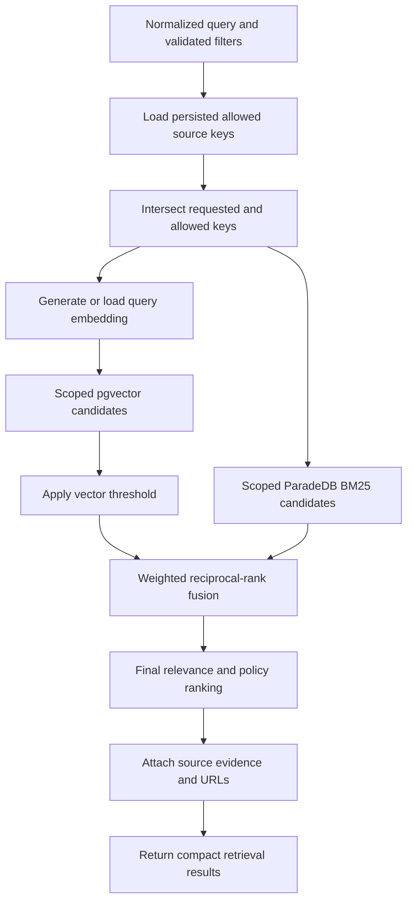

# Ask Sunny Hybrid Search Plan

## 1. Current Phase: BM25 + Vector

Ask Sunny's production retrieval target is hybrid search across the backend's three source families:

- Directorist listings.
- Optional approved Directorist reviews, classified by their parent directory type.
- Optional WordPress post types enabled by an administrator.

Each eligible query combines:

- ParadeDB `pg_search` BM25 over deterministic source text (`listings.embedding_text` for listings and `search_document` for the other kinds).
- pgvector cosine similarity over that source kind's vector storage (`listings.embedding` for listings).
- Structured filters applied consistently to both candidate paths.
- Weighted Reciprocal Rank Fusion (RRF) followed by application ranking.

Hybrid retrieval is the intended normal production mode. A new or upgraded deployment must start with hybrid disabled, however, and may enable it only after the package-compatibility and verification gates in this plan pass.

## 2. Goals And Non-Goals

### Goals

- Recover exact names, categories, locations, amenities, metadata values, and site-specific terms through BM25.
- Recover conceptually related content and natural-language intent through vector similarity.
- Search only persisted `allowed_data_source_keys` and apply status and structured constraints before fusion.
- Keep listing, review, and WordPress-content repositories separate while producing one comparable ranked result set.
- Preserve stable source IDs, URLs, source classification, and evidence for grounded chat citations.
- Continue safely in explicit vector-only mode when BM25 cannot be enabled.

### Non-goals For This Phase

- Query rewriting by an LLM.
- Neural reranking.
- Inferring hidden filters that are not supported by retrieved content or configured metadata.
- Allowing a chat caller or model tool call to expand the backend's persisted source allowlist.
- Returning review records as listing recommendation cards; reviews can support and be cited for their parent listing.

## 3. Mandatory Package Compatibility Gate

`HYBRID_SEARCH_ENABLED` must remain `false` until the installed `pg_search` artifact is proven to match the PostgreSQL process that will load it.

Record and compare all of the following:

| Compatibility field | PostgreSQL host/container evidence | Package/image evidence | Required result |
|---|---|---|---|
| PostgreSQL major | `SHOW server_version_num` | Package name/dependency or pinned database image manifest | Exact major match |
| Operating system | `/etc/os-release` `ID` and release/codename | Package release target or database image base | Supported exact target |
| CPU architecture | `dpkg --print-architecture` or `uname -m` | Package metadata/image platform | Exact compatible architecture |
| `pg_search` version | Requested release | Installed package and `pg_extension.extversion` | Pinned and recorded |

For a native deployment, the operating system is the host running PostgreSQL. For Docker, it is the operating system and architecture inside the database container, not merely the Docker host. The PostgreSQL major version must also be read from the running container rather than inferred from an image tag.

Native evidence commands:

```sh
psql -d ask_sunny -tAc "SHOW server_version;"
psql -d ask_sunny -tAc "SHOW server_version_num;"
cat /etc/os-release
dpkg --print-architecture || uname -m
dpkg-query -W 'postgresql-*-pg-search' 2>/dev/null || true
```

Before installing a downloaded Debian package, inspect rather than trust its filename:

```sh
dpkg-deb -f /tmp/pg_search.deb Package Version Architecture Depends
```

Docker evidence commands:

```sh
docker compose exec paradedb psql -U ask_sunny -d ask_sunny -tAc "SHOW server_version_num;"
docker compose exec paradedb sh -lc 'cat /etc/os-release; dpkg --print-architecture 2>/dev/null || uname -m'
docker compose exec paradedb sh -lc "dpkg-query -W 'postgresql-*-pg-search' 2>/dev/null || true"
docker compose images --digests paradedb
```

Stop the hybrid rollout if any field is missing, ambiguous, unsupported, or mismatched. Do not create the BM25 indexes, mark hybrid ready, or issue BM25 traffic. Keep `HYBRID_SEARCH_ENABLED=false`, retain vector-only retrieval, and report the detected values, expected values, and blocker. Never force-install a mismatched package.

## 4. Safe Enablement Sequence

Use this order for native and Docker deployments:

1. Inspect the deployment state and preserve existing local changes and secrets.
2. Back up PostgreSQL and verify that the backup exists and is non-empty.
3. Stop application code that is incompatible with pending migrations.
4. Set the safe rollout value `HYBRID_SEARCH_ENABLED=false`.
5. Collect the compatibility evidence from Section 3.
6. Install or select the pinned `pg_search` package/image only after every field matches.
7. Preserve existing `shared_preload_libraries`, add `pg_search` when required, and restart PostgreSQL.
8. Create and verify `vector`, `pg_search`, and `pgcrypto` with an extension-capable role.
9. Run the versioned application migrations that add search keys and all three BM25 indexes.
10. Run `ANALYZE` on the content and vector-storage tables after a large import or index build.
11. Run a direct BM25 query against listings, reviews, and WordPress content using a known local term.
12. Run application checks and a scoped hybrid integration test.
13. Set `HYBRID_SEARCH_ENABLED=true` only when every preceding gate passes.
14. Start or restart the API, confirm effective hybrid readiness, and record the final state.

The environment flag is an operator request, not proof of capability. Startup/readiness must compute an effective search mode from the flag plus extension, migration, index, and smoke-check results. If the flag is `true` while a requirement is missing, the application must refuse hybrid execution and report a degraded or not-ready state; it may continue serving explicit vector-only retrieval.

## 5. Source-Specific Search Surfaces

BM25 and vector retrieval run separately for each source kind:

| Source kind | BM25 table/index | Vector storage | Required scope |
|---|---|---|---|
| Directorist listing | `listings` / `listings_bm25_idx` | `listings.embedding` | Allowed directory key, `deleted_at IS NULL`, listing filters |
| Directorist review | `directorist_reviews` / `directorist_reviews_bm25_idx` | `directorist_review_embeddings` | Allowed classified review key, active status, parent context |
| WordPress post | `wordpress_content` / `wordpress_content_bm25_idx` | `wordpress_content_embeddings` | Allowed post-type key, active status, taxonomy/meta filters |

The same allowed keys and structured predicates must constrain both BM25 and vector candidates. Applying a filter to only one branch makes fusion incorrect and can leak disabled content into the candidate set.

## 6. Candidate Retrieval And Fusion

For each normalized query:

1. Load `installation_config.allowed_data_source_keys`; an empty list fails closed.
2. Intersect model-selected keys with the persisted list.
3. Extract validated structured constraints and build kind-specific predicates.
4. Generate or load the query embedding.
5. Retrieve bounded vector candidates that meet the configured similarity threshold.
6. Retrieve bounded BM25 candidates for the exact normalized keyword query.
7. Convert each path to deterministic ranks using score followed by a stable ID tie-breaker.
8. Fuse candidates with weighted RRF.
9. Apply final relevance, structured-match, date, location, configured metadata, review, freshness, and eligible promotion signals.
10. Attach source identity, URLs, matched evidence, and diagnostics for downstream citations.

RRF avoids blending incomparable raw BM25 and cosine score ranges:

```text
fused_score = vector_weight / (rrf_k + vector_rank)
            + bm25_weight / (rrf_k + bm25_rank)
```

Initial settings:

```dotenv
HYBRID_SEARCH_ENABLED=false
HYBRID_VECTOR_WEIGHT=0.65
HYBRID_BM25_WEIGHT=0.35
HYBRID_RRF_K=60
HYBRID_CANDIDATE_MULTIPLIER=3
HYBRID_MAX_CANDIDATE_LIMIT=100
```

The first value is the safe installation and upgrade value. A verified normal production deployment changes it to `true`. Weight changes require evaluation and a ranking-version bump so cached or historical results are not confused with a new policy.

## 7. Runtime Flow



## 8. Failure And Fallback Policy

- Package, OS, architecture, or PostgreSQL-major mismatch: do not install or enable; use vector-only mode.
- `pg_search` missing from required preload configuration: do not enable until PostgreSQL is restarted and verified.
- Extension missing or wrong version: do not enable; report extension diagnostics.
- Any required BM25 index missing: do not enable; repair through a reviewed migration.
- Direct BM25 smoke query fails: do not enable; capture the SQL error and extension/index state.
- Application contract or integration check fails: do not report the service healthy in hybrid mode.
- Runtime BM25 failure after a verified deployment: fail that BM25 operation closed, emit high-signal diagnostics, and use the documented vector-only path without claiming a hybrid score.
- Vector or embedding failure: do not present BM25-only output as normal hybrid output unless an explicit product fallback policy is added and tested.

Health and diagnostics must distinguish `requested`, `effective`, and `reason`, for example:

```json
{
  "hybrid_search": {
    "requested": true,
    "effective": false,
    "status": "degraded",
    "reason": "pg_search_package_postgresql_major_mismatch"
  }
}
```

## 9. Testing And Evaluation

Required automated coverage:

- Allowlist and structured filters are identical in BM25 and vector branches.
- Disabled review and WordPress sources cannot contribute candidates.
- All three source kinds participate when allowed.
- RRF ordering is deterministic, including one-branch-only candidates and ties.
- Vector thresholds are applied before fusion.
- Review evidence links to its parent listing without becoming a listing card.
- Missing extensions/indexes or failed smoke checks prevent effective hybrid mode.
- A package compatibility mismatch keeps hybrid disabled.
- Vector-only fallback uses vector scores and identifies its mode accurately.

Evaluation set segments:

- Exact title or name queries.
- Category, location, amenity, and metadata-value queries.
- Natural-language intent and synonym queries.
- Date-sensitive Event Directory queries.
- Review and rating questions.
- Editorial questions answered by optional WordPress content.
- Cross-source questions and zero-result cases.

Track top-1/top-3 relevance, citation correctness, zero-result rate, BM25-only wins, vector-only wins, fused wins, latency, candidate counts, fallback rate, and source-filter violations. Tune weights only after reviewing this segmented evidence.

## 10. Deferred Phases

### Query Rewriting

Consider structured query rewriting only after production query logs and a labeled evaluation set exist. It must preserve names, numbers, dates, locations, prices, categories, and the original query; it must not invent structured filters. On low confidence or provider failure, use the original query.

### Neural Reranking

Consider reranking only after BM25 + vector quality is measured. Bound it to the top fused candidates, keep its score separate in diagnostics, set a strict timeout, and fall back to fused order on error.

## 11. Completion Criteria

The hybrid phase is complete when:

- Native and optional Docker compatibility gates are documented and tested.
- The installed `pg_search` artifact matches PostgreSQL major, execution OS, and architecture.
- All source-kind BM25 and vector indexes exist and are healthy.
- Direct BM25, vector, and fused smoke tests pass within allowed source scopes.
- Health reports the requested and effective search modes accurately.
- The evaluation set meets agreed relevance and latency thresholds.
- Backup, rollback, vector-only fallback, and final deployment reporting are rehearsed.
