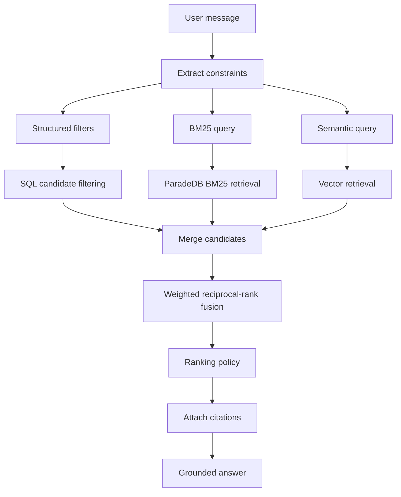
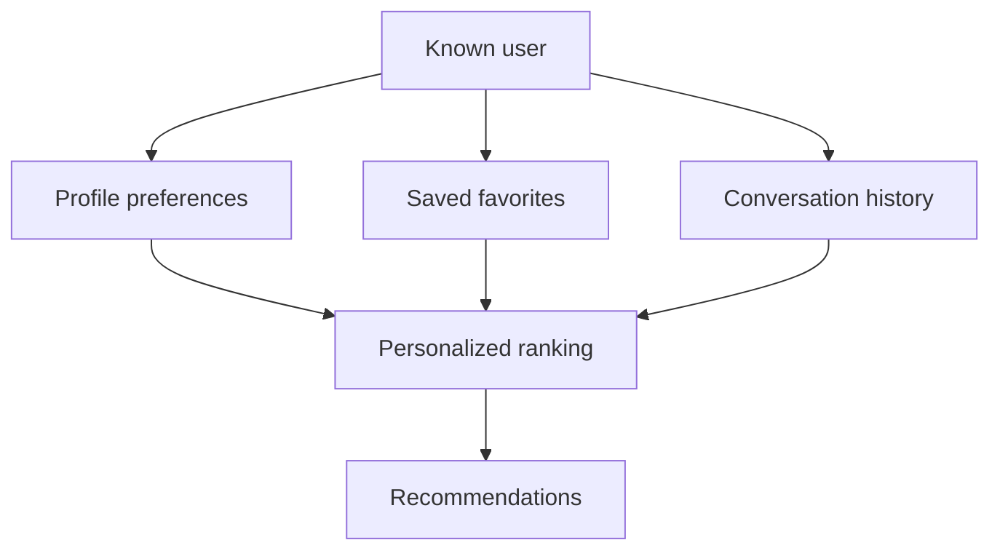

# Data And RAG Design

## Source Content

The primary content source is Directorist listings. Directorist multi-directory support allows one listing post type to be classified into multiple directory types. Each directory type is a distinct data source for retrieval context. For example, an Event Directory contains listings with event-related fields; it is not a separate `event_listing` source type.

Source rules:

- Every discovered Directorist directory type is registered as a mandatory data source and all eligible published listings in it are indexed. The administrator cannot disable Directorist listing sources.
- A listing belongs to the data source identified by its Directorist directory type, such as `directorist:events` or `directorist:businesses`.
- Each directory type exposes a classified review key, such as `directorist:events:reviews`, under one optional **Listing Reviews** source family. Administrators enable or disable reviews globally, not per directory type. When the global setting is enabled, approved reviews from all directory types are indexed as `directorist_review` records and reference their parent listing; they are not folded into the listing embedding.
- A review inherits the parent listing's directory type, categories, locations, source URL, and relevant context metadata so retrieval can filter reviews by the same context as listings.
- Event dates, promotions, and other Directorist features remain fields or related context on a listing; they do not create parallel listing source types.
- The administrator may enable or disable eligible non-Directorist WordPress post types, including `post`, `page`, and public custom post types.
- Each enabled WordPress post type becomes a data source, such as `wordpress:post` or `wordpress:page`.
- Disabling an optional source preserves previously indexed backend records but removes its key from the backend's persisted `allowed_data_source_keys`. Only an explicit admin delete action removes indexed records.
- Each data source carries context metadata used by RAG, such as label, description, content kind, audience, and installation-specific key/value attributes.
- Optional WordPress sources may define inclusion filters. At minimum, support taxonomy-term filters, such as indexing only posts in selected categories. A controlled allowlist may add safe post-meta filters; arbitrary SQL or callbacks are not accepted as configuration.
- Source kinds use separate backend persistence boundaries and are not stored in one generic content table. Directorist listing rows store raw and normalized metadata, deterministic embedding text, the vector, content hash, indexing timestamps, and soft-delete state together in `listings`. Reviews and optional WordPress content retain their own content and embedding tables. Retrieval queries each allowed kind independently and merges scored candidates afterward.

Future content can be added by enabling the relevant post type rather than adding hardcoded content-specific branches:

- FAQs.
- User profile data.
- Favorites and saved content.
- Push notification preferences.

## Retrieval Model

Ask Sunny should combine structured filtering, ParadeDB BM25 keyword matching, and pgvector semantic retrieval. Do not rely on a generic website-context chatbot.

Representative questions:

- "What events are happening near downtown this Saturday?"
- "Which service providers are available this week and match my budget?"
- "What does the site say about its cancellation policy?"

The retrieval layer must first load the backend's persisted `allowed_data_source_keys`, then select relevant keys from that allowlist using source context metadata. It must never expand beyond the stored allowlist. Within the allowed sources, it should reason over structured fields such as location, date, availability, amenities, budget, categories, reviews, core preset columns, generic listing metadata, and featured state.

Structured filters:

- Data source key and context metadata.
- Date and time for listings from an Event Directory.
- Location and distance.
- Category and directory type.
- Eligibility or other configured metadata fields.
- Physical/virtual format or other site-defined suitability.
- Amenities.
- Budget or price level.
- Featured state and configured promotion metadata when present.

Keyword retrieval:

- ParadeDB `pg_search` BM25 over deterministic `search_document` text for each source kind.
- Exact names, phrases, categories, locations, amenities, and rare site-specific terminology.
- Bounded candidates produced only after allowed-key, status, and applicable structured constraints.

Semantic retrieval:

- User intent and natural-language needs.
- Domain-specific synonyms and equivalent terms configured for the site.
- Editorial context from articles, newsletter posts, and FAQs.
- Review text retrieved from the selected Directorist review data source.



## Ranking Policy

Ranking should prioritize relevance first.

Base signals:

- BM25 keyword rank.
- Semantic similarity.
- Exact structured match.
- Event-date match when the listing's directory type provides event fields.
- Location/distance match.
- Match against configured listing metadata.
- Amenity match.
- Category match.
- Freshness.
- Review/rating signal when available.

Promotion signals must be metadata-driven rather than fixed content-table columns. Featured content may receive a ranking boost only after meeting the user's actual constraints. Extension-provided promotion fields, if present, live in `listing_metadata` and require an explicit ranking configuration before use.

When the optional Listing Reviews family is enabled, a review record may contribute BM25/semantic evidence and aggregate rating signals to its parent listing through `parent_data_source_key` and `parent_source_id`. A review is not returned as a listing recommendation card, but it may be cited directly when its text supports the answer.

## Clarifying Questions

Ask a follow-up question when a high-quality answer needs missing constraints:

- Eligibility or other domain-specific requirements.
- Preferred location.
- Date or time window.
- Category or content-type preference.
- Budget.
- Willingness to drive.

Do not over-ask. If enough defaults are available, answer and include a follow-up prompt.

## Citation Rules

Every recommendation should include:

- Title.
- Direct URL.
- Data source label and direct source key.
- Reason it matched.
- Featured state and any configured disclosure metadata.

The assistant should avoid inventing details not present in retrieved content. If dates, availability, or operating hours are uncertain, say so and link to the source.

## Content Normalization

Embedding text should include:

```text
Title: Community Workshop
Source Kind: Directorist Listing
Data Source: Event Directory (directorist:events)
Source Context: content_kind = event
Summary: Introductory workshop with advance registration.
Categories: Workshops, Education
Locations: Downtown
Amenities: Wheelchair access, Parking
Price: USD 25.00
Phone: +1-555-0100
Website: https://workshop.example.com
Address: 100 Main Street, Downtown
Description: Cleaned listing content.
Listing Metadata:
- Experience Level (select): Beginner
- Event Start (directorist-events, datetime): 2026-07-11T10:00:00Z
Editorial Notes: Related article or newsletter mentions when available.
```

Embedding generation must serialize every non-empty, public, content-bearing listing field and every value in the flat `normalized_metadata.listing_metadata` map. Operational values such as database IDs, hashes, timestamps used only for synchronization, raw debug payloads, and private/admin-only fields are excluded. Sort metadata by stable field key so identical content produces identical embedding text and hashes. The resulting `embedding_text`, vector, and `content_hash` are persisted on the same `listings` row.

The same normalization rule applies independently to the other source tables: review embeddings include public `directorist_reviews` columns plus `review_metadata`, and WordPress-content embeddings include public `wordpress_content` columns plus `taxonomies` and `post_metadata`. Their embedding text and hashes are computed within the source-kind repository and stored through that kind's vector-storage contract.

For each metadata entry, include its label, stable key, field type, provider when present, and sanitized value. Flatten arrays in their saved order, format dates/times consistently, and include file-upload URLs rather than file contents. Any change to a column or included metadata value must change the content hash and trigger re-embedding.

Review embedding text should be independent:

```text
Review For: Community Workshop
Source Kind: Directorist Review
Data Source: Event Directory Reviews (directorist:events:reviews)
Parent Listing ID: 2001
Rating: 5
Directory Type: Event Directory
Categories: Workshops, Education
Locations: Downtown
Review: Cleaned approved review text.
```

Exclude:

- Raw HTML.
- Admin-only notes.
- Private user data.
- Payment information.
- Generic empty custom field labels.

## Personalization

Personalization is future-facing but should be designed now.

Inputs:

- Domain-specific and accessibility preferences.
- Home location or preferred areas.
- Interests.
- Budget.
- Travel distance.
- Favorite content items.
- Previous conversation history.



Rules:

- Anonymous users can receive session-level continuity.
- Logged-in users can receive cross-device personalization.
- Users must have a path to delete or reset personalization data.
- Relevance remains the first requirement for any configured promotional metadata.

## Tool Design

The LangGraph agent should use server-owned tools:

```json
{
  "name": "search_content",
  "arguments": {
    "data_source_keys": ["directorist:events"],
    "query": "beginner workshops",
    "filters": {
      "date": "2026-07-11",
      "location": "Downtown",
      "metadata_filters": {"experience_level": "beginner"}
    },
    "limit": 6
  }
}
```

Tool outputs should be compact:

```json
{
  "results": [
    {
      "source_kind": "directorist_listing",
      "data_source_key": "directorist:events",
      "data_source_label": "Event Directory",
      "source_id": "2001",
      "title": "Community Workshop",
      "url": "https://example.com/events/community-workshop",
      "matched_metadata": {"event_start": "2026-07-11T10:00:00Z"},
      "reason": "Matches the requested date, location, and experience level.",
      "score": 0.91
    }
  ]
}
```

The server must intersect every model-selected `data_source_keys` value with the persisted `allowed_data_source_keys`. The model and chat caller cannot override or expand the allowlist through tool arguments or request fields. An empty or missing backend allowlist fails closed and yields no RAG candidates.

The tool delegates to the internal SV-US-008 retrieval contract. Core category, location, amenity,
price, rating, distance, and taxonomy filters use server-owned paths. Generic metadata/date keys must
also appear in the selected source's persisted `context_metadata.retrieval_filter_keys`. Both BM25 and
vector queries receive the same validated predicates; a source that cannot apply a requested filter
does not match. Results use stable source identity, `0..1` normalized fused scores, compact matched
metadata, and `result_role=review_evidence` for reviews with active allowed parent identity. The exact
filter shapes, bounds, score calculation, and request-local BM25 fallback are defined in the server
[`HYBRID_SEARCH_PLAN.md`](../server/HYBRID_SEARCH_PLAN.md).

## Evaluation

Track:

- Top recommendation click-through.
- Citation click-through.
- Zero-result rate.
- Clarifying-question rate.
- User thumbs-up/down when available.
- Configured promotion/disclosure metrics when applicable.
- Structured-field correctness, including dates when applicable.
- Data-source selection and source-context filter correctness.
- Results with missing URLs.
- Backend latency and selected-provider token usage.
- BM25, vector, and fused-result contribution rates.
- Active AI provider, provider latency, token usage, and provider error rate.
