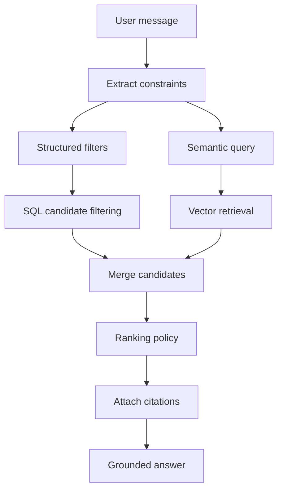
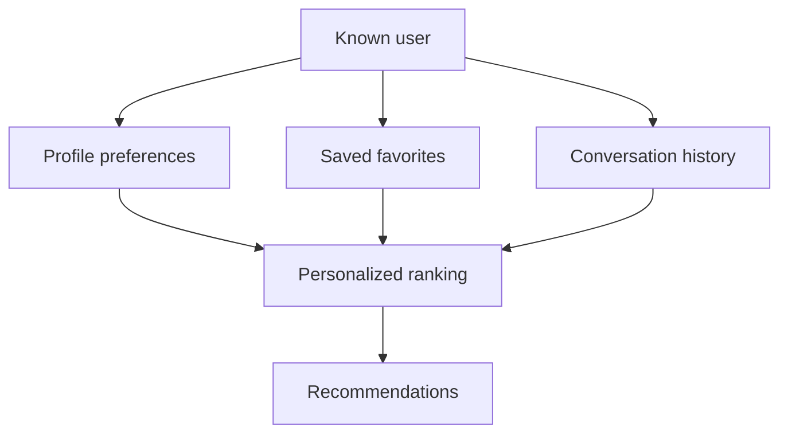

# Data And RAG Design

## Source Content

Initial content comes from WordPress and Directorist:

- Listings from configured Directorist directory types.
- Event listings where an events directory is enabled.
- Reviews associated with indexed listings.
- Configured editorial or newsletter posts.
- Promotions and sponsored content.

Future content sources:

- Blog posts.
- FAQs.
- User profile data.
- Favorites and saved content.
- Push notification preferences.

## Retrieval Model

Ask Sunny should combine structured filtering and semantic retrieval. Do not rely on a generic website-context chatbot.

Representative questions:

- "What events are happening near downtown this Saturday?"
- "Which service providers are available this week and match my budget?"
- "What does the site say about its cancellation policy?"

The retrieval layer should search all relevant enabled sources before the model generates an answer. It should reason over structured fields such as location, date, availability, amenities, budget, categories, reviews, configurable attributes, custom fields, and featured or sponsored status.

Structured filters:

- Date and time for events.
- Location and distance.
- Category and directory type.
- Eligibility or other configured attributes.
- Physical/virtual format or other site-defined suitability.
- Amenities.
- Budget or price level.
- Featured/sponsored state.

Semantic retrieval:

- User intent and natural-language needs.
- Domain-specific synonyms and equivalent terms configured for the site.
- Editorial context from articles, newsletter posts, and FAQs.
- Review text where relevant.



## Ranking Policy

Ranking should prioritize relevance first.

Base signals:

- Semantic similarity.
- Exact structured match.
- Event date match.
- Location/distance match.
- Match against configured attributes.
- Amenity match.
- Category match.
- Freshness.
- Review/rating signal when available.

Promotion signals:

- Featured listing or content item.
- Sponsored-content status.
- Active promotion.

Featured and sponsored content can receive a ranking boost only after meeting the user's actual constraints. If a sponsored item appears, response metadata should include `is_sponsored: true`; the UI can display a small label.

## Clarifying Questions

Ask a follow-up question when a high-quality answer needs missing constraints:

- Eligibility or other domain-specific requirements.
- Preferred location.
- Date or time window.
- Category or content-type preference.
- Budget.
- Willingness to drive.

Do not over-ask. If enough defaults are available, answer and include a follow-up prompt.

## Citation Rules

Every recommendation should include:

- Title.
- Direct URL.
- Source type.
- Reason it matched.
- Sponsored/featured flags.

The assistant should avoid inventing details not present in retrieved content. If dates, availability, or operating hours are uncertain, say so and link to the source.

## Content Normalization

Embedding text should include:

```text
Title: Community Workshop
Source Type: Event Listing
Summary: Introductory workshop with advance registration.
Categories: Workshops, Education
Locations: Downtown
Amenities: Wheelchair access, Parking
Attributes: Experience level = Beginner
Price Level: $$
Description: Cleaned listing content.
Reviews: Short selected review snippets.
Editorial Notes: Related article or newsletter mentions when available.
```

Exclude:

- Raw HTML.
- Admin-only notes.
- Private user data.
- Payment information.
- Generic empty custom field labels.

## Personalization

Personalization is future-facing but should be designed now.

Inputs:

- Domain-specific and accessibility preferences.
- Home location or preferred areas.
- Interests.
- Budget.
- Travel distance.
- Favorite content items.
- Previous conversation history.



Rules:

- Anonymous users can receive session-level continuity.
- Logged-in users can receive cross-device personalization.
- Users must have a path to delete or reset personalization data.
- Do not personalize sponsored content beyond relevance; relevance remains the first requirement.

## Tool Design

The LangGraph agent should use server-owned tools:

```json
{
  "name": "search_content",
  "arguments": {
    "source_types": ["event_listing"],
    "query": "beginner workshops",
    "filters": {
      "date": "2026-07-11",
      "location": "Downtown",
      "attributes": {"experience_level": "beginner"}
    },
    "limit": 6
  }
}
```

Tool outputs should be compact:

```json
{
  "results": [
    {
      "source_type": "event_listing",
      "source_id": "2001",
      "title": "Community Workshop",
      "url": "https://example.com/events/community-workshop",
      "starts_at": "2026-07-11T10:00:00Z",
      "reason": "Matches the requested date, location, and experience level.",
      "score": 0.91,
      "is_sponsored": false
    }
  ]
}
```

## Evaluation

Track:

- Top recommendation click-through.
- Citation click-through.
- Zero-result rate.
- Clarifying-question rate.
- User thumbs-up/down when available.
- Sponsored impression and click metrics.
- Structured-field correctness, including dates when applicable.
- Results with missing URLs.
- Backend latency and OpenAI token usage.
