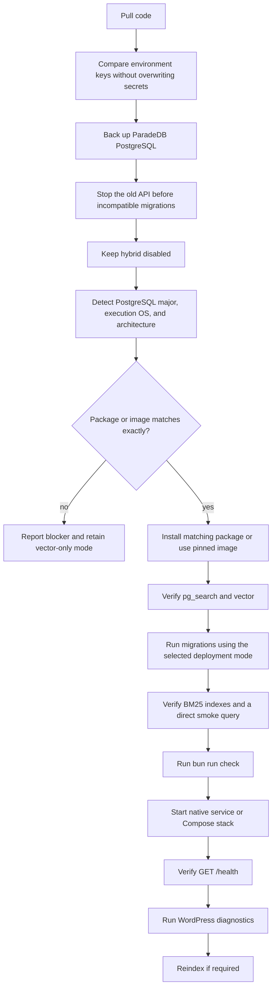

# Setup And Operations

## Local Development

Recommended layout:

```text
wordpress-site/
  wp-content/
    plugins/
      ask-sunny/

ask-sunny-api-server/
ask-sunny-docs/
```

The backend server is checked out and deployed outside the WordPress installation. WordPress communicates with it through the configured backend API URL.

Native server setup:

```sh
cd /path/to/ask-sunny-api-server
cp .env.example .env
sudo systemctl start postgresql
bun install
bun run db:migrate
bun run check
bun run dev
```

Optional Docker setup:

```sh
cd /path/to/ask-sunny-api-server
cp .env.example .env
docker compose build
docker compose up -d paradedb redis
docker compose run --rm api bun run db:migrate
docker compose up -d api
docker compose exec api bun run check
```

WordPress setup:

```text
1. Activate Directorist.
2. Activate Ask Sunny.
3. Configure the backend API URL.
4. Provision the backend API key.
5. Review Data Sources. Configure the global Listing Reviews setting and any optional WordPress post-type sources.
6. Run diagnostics.
7. Trigger the initial reindex.
8. Configure the widget's page targeting, color scheme, position, and welcome message, then enable it.
```

## Infrastructure And Deployment Options

Minimum production baseline:

```text
2 CPU cores
2 GB RAM
ParadeDB/pg_search distribution matching the running PostgreSQL major version, execution OS/release, and CPU architecture
pg_search + pgvector
HTTPS reverse proxy
Redis optional
Docker Engine + Docker Compose optional
```

Native deployment runs Bun under a service manager such as systemd, ParadeDB/PostgreSQL as a native database service, and optional Redis behind an HTTPS reverse proxy. Bind the Bun service to a private interface and do not expose the raw application or database port publicly.

Docker is optional. The Compose stack contains at least `api` and `paradedb` services and may contain `redis` and a reverse-proxy service. Only the HTTPS reverse proxy is public. Do not publish the raw Bun or database ports to the internet. Pin production image versions; do not deploy floating `latest` tags.

Use Docker volumes for ParadeDB data and any Redis persistence. Add health checks and startup ordering, but do not treat container startup alone as application readiness.

## Environment Contract

Keep all server configuration in `.env`, the native service-manager environment, or an equivalent Docker secret mechanism. Important controls include:

```dotenv
AI_PROVIDER=openai
AI_REQUEST_TIMEOUT_MS=45000

OPENAI_API_KEY=
OPENAI_BASE_URL=https://api.openai.com/v1
OPENAI_CHAT_MODEL=

GROQ_API_KEY=
GROQ_BASE_URL=https://api.groq.com/openai/v1
GROQ_CHAT_MODEL=

EMBEDDING_PROVIDER=openai
OPENAI_EMBEDDINGS_URL=https://api.openai.com/v1/embeddings
EMBEDDING_MODEL=text-embedding-3-small
EMBEDDING_DIMENSIONS=1536

HYBRID_SEARCH_ENABLED=false
HYBRID_VECTOR_WEIGHT=0.65
HYBRID_BM25_WEIGHT=0.35
HYBRID_RRF_K=60
HYBRID_CANDIDATE_MULTIPLIER=3
HYBRID_MAX_CANDIDATE_LIMIT=100
MAX_ALLOWED_SEARCH_IDS=1000
```

`AI_PROVIDER=openai|groq` is the single generation-provider switch. The runtime provider registry resolves the selected adapter without changing orchestration or persistence code. The selected adapter's key, base URL, and model must validate at startup. Credentials for the inactive generation provider may be omitted. Embeddings remain independently configured so changing the chat provider never silently changes vector dimensions or forces a reindex. Provider identity is not persisted in application tables.

`HYBRID_SEARCH_ENABLED=false` is the required safe value during installation and upgrade. Hybrid is the expected production mode only after the compatibility, extension, migration, index, direct-query, and application gates below pass; then set it to `true` deliberately.

Environment safety rules:

- Keep `.env` out of Git.
- Compare `.env` with `.env.example` during deployment and add missing keys without overwriting existing secret values.
- Never print provider, embedding, provisioning, database, or installation secrets.
- Use long random provisioning and installation keys.
- Keep the generated backend installation key only in WordPress server-side options.
- Set secure cookies for admin sessions behind HTTPS.

## Deployment Flow



For both deployment modes, back up first, preserve secrets, inspect compatibility before installation, stop incompatible old code before migrations, verify extensions and indexes directly, keep hybrid disabled on verification failure, and report every fallback.

### Native Production Deployment

Keep `HYBRID_SEARCH_ENABLED=false`. Detect the PostgreSQL major version from the running server and the OS/release and architecture from the same host. On Debian-family systems, inspect the downloaded package metadata as well as its release target before installation:

```sh
psql -d ask_sunny -tAc "SHOW server_version;"
psql -d ask_sunny -tAc "SHOW server_version_num;"
cat /etc/os-release
dpkg --print-architecture || uname -m
dpkg-deb -f /tmp/pg_search.deb Package Version Architecture Depends
```

The package name/dependencies must target the detected PostgreSQL major, its release must support the detected OS ID/release or codename, and its architecture must match the host. Use equivalent package metadata commands on non-Debian systems. If any field is missing, ambiguous, or mismatched, do not install it or continue with hybrid enabled; record the blocker and retain vector-only mode.

After a complete match is proven, install the pinned package by following the official self-hosted extension guide. Add `pg_search` to the active `shared_preload_libraries` value when required, preserve any existing libraries, restart PostgreSQL, and verify both extensions:

```sh
psql -d ask_sunny -tAc "SHOW shared_preload_libraries;"
sudo systemctl restart postgresql
psql -d ask_sunny -c "CREATE EXTENSION IF NOT EXISTS pg_search;"
psql -d ask_sunny -c "CREATE EXTENSION IF NOT EXISTS vector;"
psql -d ask_sunny -c "SELECT extname, extversion FROM pg_extension WHERE extname IN ('pg_search', 'vector') ORDER BY extname;"
```

Then deploy the native Bun service:

```sh
cd /var/www/ask-sunny-api
bun install --production
sudo systemctl stop ask-sunny-api
bun run db:migrate
bun run check
sudo systemctl start ask-sunny-api
sudo systemctl status ask-sunny-api --no-pager
```

Install and configure ParadeDB `pg_search` and pgvector only after the native compatibility evidence passes. Run direct BM25 and application checks, then set `HYBRID_SEARCH_ENABLED=true`. Use systemd or an equivalent supervisor for automatic restart, environment loading, log collection, and graceful shutdown.

### Optional Docker Production Deployment

```sh
docker compose build
docker compose up -d paradedb
docker compose exec paradedb psql -U ask_sunny -d ask_sunny -tAc "SHOW server_version_num;"
docker compose exec paradedb sh -lc 'cat /etc/os-release; dpkg --print-architecture 2>/dev/null || uname -m'
docker compose exec paradedb sh -lc "dpkg-query -W 'postgresql-*-pg-search' 2>/dev/null || true"
docker compose images --digests paradedb
docker compose stop api
docker compose run --rm api bun run db:migrate
docker compose run --rm api bun run check
docker compose up -d
docker compose ps
docker compose exec paradedb psql -U ask_sunny -d ask_sunny -c "SELECT extname, extversion FROM pg_extension WHERE extname IN ('pg_search', 'vector') ORDER BY extname;"
```

The pinned database image must provide evidence that its installed `pg_search` artifact targets the PostgreSQL major, OS/release, and architecture inside that database container. Do not infer compatibility only from the Docker host or image tag. If the evidence does not match, keep the API in vector-only mode and do not run BM25 migrations. Compose overrides native connection hosts with service names such as `paradedb` and `redis`; the application image and environment contract otherwise remain identical to native deployment.

## ParadeDB And Migration Safety

- Back up the database before extension or schema changes and verify that the backup is non-empty.
- Apply migrations with an idempotent migration runner and record versions in `schema_migrations`.
- Record the running PostgreSQL major, execution OS/release, CPU architecture, package/image version, and Docker image digest when applicable; every `pg_search` target must match before installation or BM25 migration.
- Verify that `pg_search` is loaded through `shared_preload_libraries` when required by the installed version.
- Create BM25 indexes for listings, reviews, and WordPress content.
- Run `ANALYZE` after large indexing operations and BM25-index creation.
- Run a direct BM25 query using the `|||` operator and `pdb.score(search_key)` against a known local term.
- Start installation and upgrades with `HYBRID_SEARCH_ENABLED=false`. Set it to `true` only after package compatibility, preload, extension, migration, index, direct smoke-query, and application checks pass; otherwise retain vector-only degraded mode.
- Add indexes concurrently for large production tables when supported and safe.
- Do not change embedding dimensions without a migration and complete re-embedding plan.
- Do not roll back migrations unless an operator approves a tested restore path.

## Reindexing

Initial reindex:

```text
1. Provision the backend API key.
2. Refresh the WordPress-local registry and synchronize the complete allowed data-source list.
3. Reindex every mandatory Directorist directory-type listing source.
4. If the global Listing Reviews source is enabled, reindex approved reviews from every Directorist directory type.
5. Reindex each enabled optional WordPress post-type source after applying its local filters.
6. Verify per-source and per-item statuses in Data Sources.
7. Verify backend content counts and BM25/vector availability by data-source key.
8. Run admin chat tests that exercise both keyword and semantic retrieval.
```

Reindex after changes:

- New embedding model or dimensions: migrate every vector-storage surface, including `listings.embedding`, and force a full reindex.
- New normalization or `search_document` rules: force a full or versioned reindex.
- Single listing update: index one item.
- When global Listing Reviews is enabled, review approval/content/rating changes reindex the review; unapproval, spam, trash, or deletion tombstones it.
- When global Listing Reviews is disabled, do not enqueue new review indexing work and remove every review key from the backend allowlist without deleting retained rows.
- Unpublish/delete: call the backend delete route.
- Optional source disabled: preserve indexed records, stop automatic indexing, and atomically remove the key from the backend allowlist.
- Optional source enabled: atomically restore the key and reconcile eligible items.
- Optional source filter change: reconcile the indexed set against the new filter.
- Admin **Delete indexed data**: tombstone one selected item; **Delete all indexed data** tombstones every item for the selected source without changing its enabled state.

## Monitoring

Track:

- `/health` status plus native service-manager or optional Docker container health.
- Chat request count, latency, timeout count, and complete-response failures.
- Selected AI provider, model, errors, rate limits, latency, and token usage.
- Embedding-provider model, errors, rate limits, and latency.
- Indexing success/failure count and content counts by source key and kind.
- BM25 candidate count, vector candidate count, fused-result count, and hybrid fallback count.
- `pg_search`, pgvector, and required BM25-index health.
- Database connection pool usage and slow queries.
- Optional Redis availability and cache behavior.

## Backup And Recovery

Back up:

- ParadeDB PostgreSQL through a database-consistent backup procedure; back up Docker volumes only as an additional Docker-specific safeguard.
- Server `.env` or secret-store records.
- Native service/reverse-proxy configuration and, when used, Docker Compose configuration plus pinned image versions.
- WordPress database options and post/comment meta.
- Plugin files through normal code deployment.

Recovery sequence:

```text
1. Restore ParadeDB PostgreSQL.
2. Restore the server environment and native service or optional Compose configuration.
3. Start ParadeDB and optional Redis using the selected deployment mode.
4. Verify pg_search, vector, migrations, and BM25 indexes.
5. Run a direct BM25 smoke query; keep hybrid disabled if it fails.
6. Start the API service and verify /health plus the selected AI provider.
7. Verify the WordPress installation key still works.
8. Run WordPress diagnostics.
9. Reindex if content or search documents are stale.
```

## Troubleshooting

### Widget Does Not Appear

- Confirm the widget is enabled.
- Confirm the current page matches the configured display mode and page IDs.
- Confirm assets are enqueued only where the widget should render.
- Confirm no cache optimizer delayed or stripped widget JavaScript.
- Confirm theme footer hooks run.

### Chat Returns A Generic Failure

- Check WordPress logs and backend logs using the correlation ID.
- Verify the backend installation key and `/health`.
- Verify `AI_PROVIDER` and that provider's API key, base URL, model, and supported request parameters.
- Verify the embedding-provider configuration separately.

### Results Are Irrelevant

- Check whether the expected source is enabled and indexed.
- Inspect normalized content for an incorrect source key, missing context, missing core columns, or incomplete metadata.
- Verify `search_document`, embeddings, `pg_search`, all required BM25 indexes, direct BM25 queries, vector queries, and hybrid-fusion diagnostics.
- Review ranking weights and configured promotion boosts.

### Event Directory Recommendations Have Wrong Dates

- Confirm the listing is classified under the correct Directorist Event Directory source.
- Inspect event extension values under `listing_metadata`.
- Verify conversion to the installation timezone.
- Ensure old or expired events are inactive or filtered.

### Provisioning Fails

- Verify the server-side provisioning key matches the backend environment.
- Verify the API URL is reachable from WordPress.
- Verify backend logs for `authentication_error`.
- Rotate the provisioning key only after updating both sides.

## Production Readiness Checklist

- The selected native or Docker deployment exposes only the HTTPS reverse proxy; Docker images are pinned when Docker is used.
- The final report records the running PostgreSQL major, execution OS/release, CPU architecture, `pg_search` package/extension version, Docker image digest when applicable, and a passing exact-match compatibility decision.
- ParadeDB, `pg_search`, and pgvector are installed and compatible; any missing or mismatched evidence keeps hybrid disabled.
- Required migrations, BM25 indexes, `ANALYZE`, direct BM25 smoke queries, and application checks pass before hybrid search is enabled.
- Backend `/health` and WordPress diagnostics pass.
- `AI_PROVIDER` selects a configured, verified OpenAI or Groq adapter.
- Initial reindex completes.
- Every Directorist directory type has a required listing source, and reviews are controlled by one global optional Listing Reviews setting.
- Global reviews and optional WordPress sources honor enabled state and filters.
- Disabled optional sources remain stored but never appear in RAG results.
- WordPress and backend allowlist versions match; an empty or missing backend allowlist fails closed.
- Per-item and per-source delete actions require explicit confirmation.
- Per-item indexing status and failures are visible in WordPress admin.
- Chat works for anonymous and logged-in visitors and returns one complete response with citations and recommendations.
- Widget page targeting, color scheme, position, and welcome message match the saved configuration.
- OpenAI, Groq, embedding-provider, and backend installation keys are absent from browser source.
- Featured recommendations and configured promotion disclosures are labeled.
- Backup and restore rehearsals pass.
- Error logs and alerts are monitored.
- Privacy deletion/export behavior is documented before long-term personalization is enabled.
