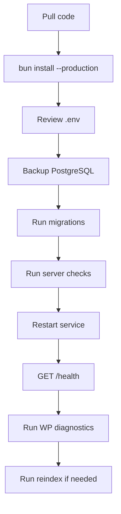

# Setup And Operations

## Local Development

Recommended layout:

```text
wordpress-site/
  wp-content/
    plugins/
      ask-sunny/

ask-sunny-api-server/
ask-sunny-docs/
```

The backend server should be checked out and deployed outside the WordPress installation. WordPress communicates with it through the configured backend API URL.

Server setup:

```sh
cd /path/to/ask-sunny-api-server
bun install
cp .env.example .env
bun run db:migrate
bun run dev
```

WordPress setup:

```text
1. Activate Directorist.
2. Activate Ask Sunny.
3. Configure the backend API URL.
4. Provision the backend API key.
5. Review the Data Sources submenu. Directorist listing and review sources are already enabled; configure any optional WordPress post-type sources and filters.
6. Run diagnostics.
7. Trigger initial reindex.
8. Enable the frontend widget.
```

## Infrastructure

Minimum production baseline:

```text
2 CPU cores
2 GB RAM
PostgreSQL 15+
pgvector
HTTPS reverse proxy
Redis optional
```

The Bun process should listen on `127.0.0.1` behind Nginx. Do not expose the raw Bun port publicly.

## Deployment Flow



## Environment Safety

- Keep `.env` out of Git.
- Never overwrite production secrets during deploy.
- Use long random provisioning and API keys.
- Keep `OPENAI_API_KEY` only on the backend.
- Keep generated backend installation key only in WordPress server-side options.
- Set secure cookies for admin sessions behind HTTPS.

## Migrations

Migration rules:

- Run database backup before schema changes.
- Apply migrations with an idempotent migration runner.
- Record applied versions in `schema_migrations`.
- Do not change embedding dimensions without a re-embedding plan.
- Add indexes concurrently for large production tables when possible.

## Reindexing

Initial reindex:

```text
1. Provision backend API key.
2. Refresh the WordPress-local registry and synchronize the complete allowed data-source list to the backend.
3. Trigger WordPress reindex for every Directorist directory-type listing source, including any Event Directory.
4. Trigger review indexing for each Directorist directory type; only approved reviews are sent.
5. Trigger indexing for each enabled optional WordPress post-type source after applying its configured filters locally.
6. Verify per-source and per-item statuses in the Data Sources submenu.
7. Verify backend content counts by `data_source_key`.
8. Run a few admin chat tests.
```

Reindex after changes:

- New embedding model: force full reindex.
- New normalization rules: force full reindex or versioned reindex.
- Single listing update: index one item.
- Review approval/content/rating change: reindex the review record; unapproval, spam, trash, or deletion tombstones it.
- Unpublish/delete: call backend delete route.
- Optional source disabled: preserve indexed records, stop automatic indexing, and atomically remove the key from the backend's persisted `allowed_data_source_keys`.
- Optional source enabled: atomically restore the key to the backend allowlist and reconcile eligible items.
- Optional source filter change: reconcile the indexed item set against the new filter.
- Admin **Delete indexed data**: tombstone one selected item; **Delete all indexed data** tombstones every item for the selected source without changing its enabled state.

## Monitoring

Track:

- `/health` status.
- Chat request count and latency.
- Complete chat response failures and timeout count.
- OpenAI API errors and rate limits.
- Token usage.
- Indexing success/failure count.
- Content counts by data source key and source kind.
- Retrieval result count.
- Database connection pool usage.
- Slow queries.

## Backup And Recovery

Back up:

- PostgreSQL database.
- Server `.env`.
- WordPress database options and post meta.
- Plugin files through normal code deployment.

Recovery sequence:

```text
1. Restore PostgreSQL.
2. Restore server `.env`.
3. Start backend.
4. Verify `/health`.
5. Verify WordPress API key still works.
6. Run diagnostics.
7. Reindex if content tables are stale.
```

## Troubleshooting

### Widget Does Not Appear

- Confirm widget is enabled.
- Confirm assets are enqueued on the page.
- Confirm no cache optimizer delayed or stripped widget JS.
- Confirm theme footer hooks run.

### Chat Returns A Generic Failure

- Check WordPress debug log.
- Check backend logs for route, request ID, and OpenAI error.
- Verify backend API key is configured.
- Verify `/health`.
- Verify OpenAI API key and model config.

### Results Are Irrelevant

- Check whether content is indexed.
- Inspect normalized payload for an incorrect `data_source_key`, missing source context, missing core preset columns, or incomplete generic `listing_metadata`.
- Verify embeddings exist.
- Run admin diagnostics and sample retrieval tests.
- Review ranking boosts for featured content or explicitly configured promotion metadata.

### Event Directory Recommendations Have Wrong Dates

- Confirm the listing is classified under the correct Directorist Event Directory data source.
- Inspect the event extension values under `listing_metadata`.
- Verify conversion to the installation's configured timezone.
- Ensure old/expired events are marked inactive or filtered.

### Provisioning Fails

- Verify server-side provisioning key matches backend env.
- Verify API URL is reachable from WordPress server.
- Verify backend logs for `authentication_error`.
- Rotate provisioning key only after updating both sides.

## Production Readiness Checklist

- Backend `/health` passes.
- WordPress diagnostics pass.
- Initial reindex completed.
- All Directorist directory types appear with required listing and review sources that cannot be disabled.
- Optional WordPress sources honor their taxonomy/meta filters.
- Disabled optional sources remain stored but never appear in RAG results.
- WordPress and backend allowed-source versions match; an empty or missing backend allowlist fails closed.
- Per-item and per-source delete actions require explicit admin confirmation.
- Per-item index status and failures are visible in the Data Sources submenu.
- Chat works for anonymous visitors.
- Chat works for logged-in users.
- Chat returns one complete JSON response with the answer, citations, and recommendations.
- OpenAI key is absent from browser source.
- Backend API key is absent from browser source.
- Featured recommendations and any configured promotion disclosures are labeled in structured response metadata.
- Database backup exists.
- Error logs are monitored.
- Privacy deletion/export plan is documented before enabling long-term personalization.
